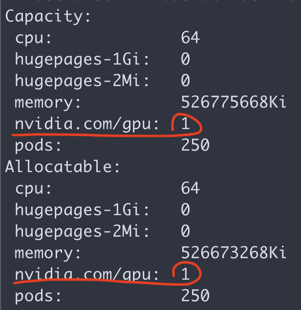
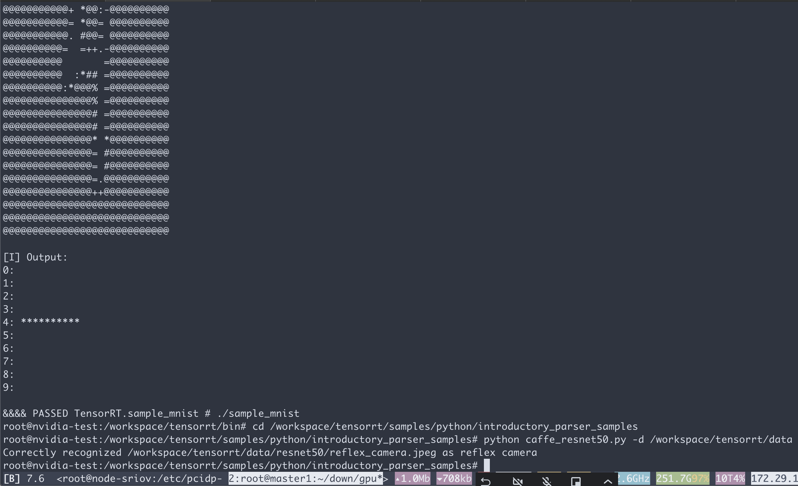
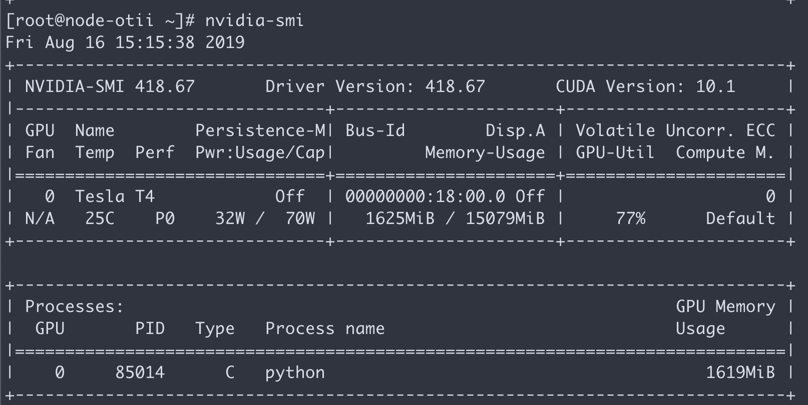
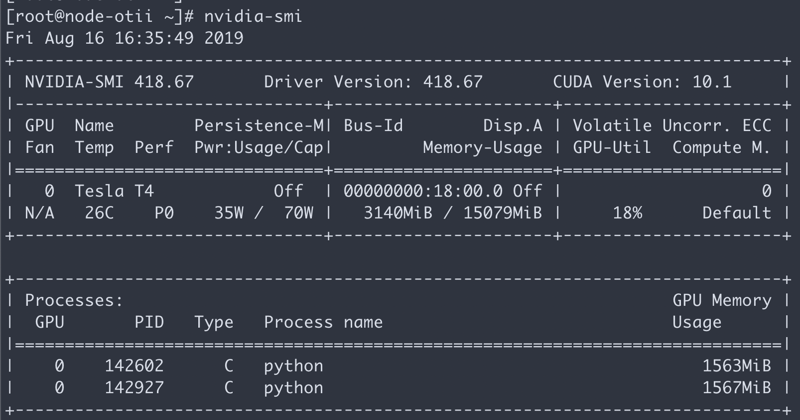
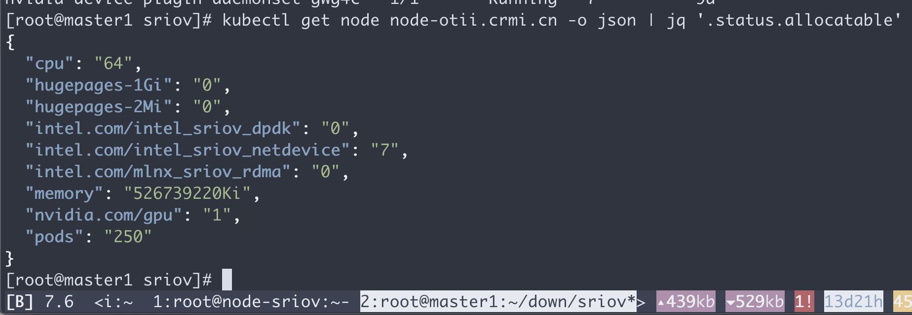
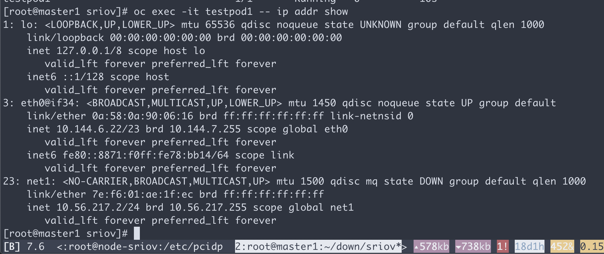

# openshift 3.11.117 离线安装

based on <https://docs.openshift.com/container-platform/3.11/install/disconnected_install.html> and <http://ksoong.org/docs/content/openshift/install/>

以下文章中的命令，不是安装时候的顺序执行命令，请搞懂命令的含义，按照自己的需要取用。

## 机器规划

https://docs.google.com/spreadsheets/d/18igPrKuOA0nOApnWBXc_qzCyqGKjSjDdmx4szn5LhHo/edit#gid=0

```bash
# copy hosts and other config files to remote
cp hosts /etc/hosts
# cp ansible_host /etc/ansible/host
cp chrony_first.conf /etc/chrony.conf
```

## 主机IP地址

```bash

timedatectl set-timezone Asia/Shanghai

hostnamectl set-hostname master1.crmi.cn
nmcli connection modify enp1s0f0 ipv4.addresses 172.29.122.232/24
nmcli connection modify enp1s0f0 ipv4.gateway 172.29.122.254
nmcli connection modify enp1s0f0 ipv4.dns 172.29.122.232
nmcli connection modify enp1s0f0 ipv4.method manual
nmcli connection modify enp1s0f0 connection.autoconnect yes
nmcli connection reload
nmcli connection up enp1s0f0

hostnamectl set-hostname master2.crmi.cn
nmcli connection modify enp1s0f0 ipv4.addresses 172.29.122.233/24
nmcli connection modify enp1s0f0 ipv4.gateway 172.29.122.254
nmcli connection modify enp1s0f0 ipv4.dns 172.29.122.232
nmcli connection modify enp1s0f0 ipv4.method manual
nmcli connection modify enp1s0f0 connection.autoconnect yes
nmcli connection reload
nmcli connection up enp1s0f0

hostnamectl set-hostname master3.crmi.cn
nmcli connection modify enp1s0f0 ipv4.addresses 172.29.122.234/24
nmcli connection modify enp1s0f0 ipv4.gateway 172.29.122.254
nmcli connection modify enp1s0f0 ipv4.dns 172.29.122.232
nmcli connection modify enp1s0f0 ipv4.method manual
nmcli connection modify enp1s0f0 connection.autoconnect yes
nmcli connection reload
nmcli connection up enp1s0f0

hostnamectl set-hostname node-sriov.crmi.cn
nmcli connection modify eno2 ipv4.addresses 172.29.122.166/24
nmcli connection modify eno2 ipv4.gateway 172.29.122.254
nmcli connection modify eno2 ipv4.dns 172.29.122.232
nmcli connection modify eno2 ipv4.method manual
nmcli connection modify eno2 connection.autoconnect yes
nmcli connection reload
nmcli connection up eno2

hostnamectl set-hostname node-otii.crmi.cn
nmcli connection modify enp134s0f0 ipv4.addresses 172.29.122.160/24
nmcli connection modify enp134s0f0 ipv4.gateway 172.29.122.254
nmcli connection modify enp134s0f0 ipv4.dns 172.29.122.232
nmcli connection modify enp134s0f0 ipv4.method manual
nmcli connection modify enp134s0f0 connection.autoconnect yes
nmcli connection reload
nmcli connection up enp134s0f0

lshw -class network

lspci | egrep -i --color 'network|ethernet'

```

## ssh 免密登录

```bash
for i in master1 master2 master3 node-sriov node-otii; do ssh-copy-id $i.crmi.cn; done;

for i in master1 master2 master3 node-sriov node-otii; do ssh $i.crmi.cn 'date'; done

```

## 配置ntp时钟

```bash
cp chrony_first.conf /etc/chrony.conf

firewall-cmd --permanent --add-port=123/udp
firewall-cmd --reload

firewall-cmd --list-all

systemctl restart chronyd
systemctl status chronyd
chronyc status

chronyc tracking
chronyc sources -v
chronyc sourcestats -v
chronyc makestep

# other nodes
ansible -i ansible_host cmcc[1:4] -u root -m ping
ansible -i ansible_host cmcc[1:4] -u root -m copy -a "src=chrony_other.conf dest=/etc/chrony.conf"
ansible -i ansible_host cmcc[1:4] -u root -m yum -a "name=chrony"
ansible -i ansible_host cmcc[1:4] -u root -m service -a "name=chronyd  state=restarted enabled=yes"
ansible -i ansible_host cmcc[1:4] -u root -m command -a "chronyc tracking"
ansible -i ansible_host cmcc[1:4] -u root -m command -a "chronyc sources -v"
ansible -i ansible_host cmcc[1:4] -u root -m command -a "chronyc sourcestats -v"
ansible -i ansible_host cmcc[1:4] -u root -m command -a "chronyc makestep"
```

## 配置yum源

我们用vsftpd来做yum源。先把之前弄好的yum镜像，解压缩到本地。

```bash

find . -name vsftp*
find . -name createrepo*
yum -y install ./data/rhel-7-server-rpms/Packages/vsftpd-3.0.2-25.el7.x86_64.rpm
mv /root/down/data /var/ftp/
systemctl start vsftpd
systemctl restart vsftpd
systemctl enable vsftpd

firewall-cmd --permanent --add-service=ftp
firewall-cmd --reload


mkdir /etc/yum.repos.d.bak
mv /etc/yum.repos.d/* /etc/yum.repos.d.bak

cat << EOF > /etc/yum.repos.d/remote.repo
[remote]
name=RHEL FTP
baseurl=ftp://yum.crmi.cn/data
enabled=1
gpgcheck=0

EOF

yum clean all
yum repolist

# 如果有问题，按照下面的链接，解决权限问题
# https://www.tuxfixer.com/vsftpd-installation-on-centos-7-with-selinux/
chown -R ftp:ftp /var/ftp
chmod a-w /var/ftp

# below is no use
semanage fcontext -a -t public_content_rw_t /var/ftp
restorecon -Rvv /var/ftp
setsebool -P ftp_home_dir 1
setsebool -P ftpd_full_access 1
ls -lZ /var | grep ftp


# 一些基础的包
yum -y install ansible-2.6.18-1.el7ae
yum -y downgrade ansible-2.6.18-1.el7ae

yum -y update
yum -y install wget git net-tools bind-utils iptables-services bridge-utils bash-completion vim lrzsz unzip docker htop byobu yum-utils

# other hosts
ansible -i ansible_host cmcc[1:4] -u root -m copy -a "src=./hosts dest=/etc/hosts"

ansible -i ansible_host cmcc[1:4] -u root -m yum_repository -a "name=ftp description=ftp baseurl=ftp://yum.crmi.cn/data gpgcheck=no state=present"

ansible -i ansible_host cmcc[1:4] -u root -m yum -a "name=htop,pciutils,inxi state=present"

ansible -i ansible_host cmcc[1:4] -u root -m timezone -a "name=Asia/Shanghai"

```

## registry安装

这次的域名cmri.cn，没有证书要自己搞一个私有的。

```bash

mkdir /etc/crts/ && cd /etc/crts
openssl req \
   -newkey rsa:2048 -nodes -keyout crmi.cn.key \
   -x509 -days 365 -out crmi.cn.crt -subj \
   "/C=CN/ST=GD/L=SZ/O=Global Security/OU=IT Department/CN=*.crmi.cn"

cp /etc/crts/crmi.cn.crt /etc/pki/ca-trust/source/anchors/
update-ca-trust extract
systemctl restart docker

# on other hosts
ansible -i ansible_host cmcc[1:4] -u root -m copy -a "src=/etc/crts/crmi.cn.crt dest=/etc/pki/ca-trust/source/anchors/"
ansible -i ansible_host cmcc[1:4] -u root -m command -a "update-ca-trust extract"
ansible -i ansible_host cmcc[1:4] -u root -m service -a "name=docker state=restarted enabled=yes"
# cp /etc/crts/crmi.cn.crt /etc/pki/ca-trust/source/anchors/
# update-ca-trust extract
# systemctl restart docker
```

有了证书，就让我们愉快的开始registry安装吧。

```bash

# yum上面装
yum -y install docker-distribution

# 把 Let’s Encrypt 上传到服务器上面
mkdir /etc/crts/
# cp fullchain1.pem /etc/crts/crmi.cn.crt
# cp privkey1.pem /etc/crts/crmi.cn.key

cat << EOF > /etc/docker-distribution/registry/config.yml
version: 0.1
log:
  fields:
    service: registry
storage:
    cache:
        layerinfo: inmemory
    filesystem:
        rootdirectory: /var/lib/registry
http:
    addr: :5021
    tls:
       certificate: /etc/crts/crmi.cn.crt
       key: /etc/crts/crmi.cn.key
EOF

systemctl daemon-reload
systemctl restart docker-distribution
systemctl enable docker-distribution

# 打开防火墙
firewall-cmd --get-active-zones
firewall-cmd --zone=public --add-port=5021/tcp --permanent
firewall-cmd --reload

firewall-cmd --list-all

# 把之前下载的镜像导入本地
# docker load -i ose3-images.tgz
# docker load -i ose3-optional-imags.tgz
# docker load -i ose3-builder-images.tgz
# docker load -i docker-builder-images.tgz
# docker load -i other-builder-images.tgz
./import-images.sh
./load-image.sh

```

运行 load-images.sh 来向镜像仓库倒入镜像

## 准备DNS

```bash

yum -y install dnsmasq

cat  > /etc/dnsmasq.d/openshift-cluster.conf << EOF
local=/crmi.cn/
address=/.apps.crmi.cn/172.29.122.233
address=/master1.crmi.cn/172.29.122.232
address=/master2.crmi.cn/172.29.122.233
address=/master3.crmi.cn/172.29.122.234
address=/lb.crmi.cn/172.29.122.166
address=/infra1.crmi.cn/172.29.122.233
address=/infra2.crmi.cn/172.29.122.234
address=/registry.crmi.cn/172.29.122.232
address=/node-sriov.crmi.cn/172.29.122.166
address=/node-otii.crmi.cn/172.29.122.160
EOF

# master节点，本次环境没有外网，也没有上级dns，就不用做这里了。
cat > /etc/dnsmasq.d/origin-upstream-dns.conf << EOF 
server=192.168.253.2
EOF

systemctl start dnsmasq.service && systemctl enable dnsmasq.service && systemctl status dnsmasq.service

firewall-cmd --permanent --add-service=dns
firewall-cmd --reload

systemctl restart dnsmasq

```

## 准备安装

3.11的文档说，nfs已经不推荐了，让用glusterfs

```bash
# 3.11的文档说，nfs已经不推荐了，让用glusterfs
#yum -y install openshift-ansible nfs-utils rpcbind
#systemctl enable nfs-server

# firewall-cmd --permanent --add-service=nfs
# firewall-cmd --permanent --add-service=mountd
# firewall-cmd --permanent --add-service=rpc-bind
# firewall-cmd --reload

yum -y install openshift-ansible

# dhcp 检测命令
nmap --script broadcast-dhcp-discover

```

nfs 相关操作 <https://linuxconfig.org/quick-nfs-server-configuration-on-redhat-7-linux>

sr-iov 参考项目 <https://github.com/openshift/ose-sriov-network-device-plugin>，这里面，sriov-network-device-plugin 编译镜像这个，似乎可以不用做，因为docker.io 上面有。

kubevirt 参考文章 <https://blog.openshift.com/getting-started-with-kubevirt/>， 这里面有一个隐藏的，关于制作虚拟机镜像的文章，在这里<https://kubevirt.io/user-guide/docs/latest/creating-virtual-machines/disks-and-volumes.html>，找到 containerDisk 的章节，这个意思就是虚拟机镜像，就放到registry里面就可以了，但是这个镜像，要特殊的来做。

GPU 参考 <https://blog.openshift.com/how-to-use-gpus-with-deviceplugin-in-openshift-3-10/>


## ansible-console

以下内容，不能全部执行，根据需要自取。

```bash

ansible -i ansible_host cmcc -u root -m lineinfile -a "path=/etc/ssh/sshd_config regexp='^UseDNS' line='UseDNS no' insertafter=EOF state=present"
ansible -i ansible_host cmcc -u root -m service -a "name=sshd state=restarted enabled=yes"

```

## 开始安装

在安装的时候，发现需要手动的push openshift3/ose:latest这个镜像，随便什么内容都可以。不然检查不过。我用的openshift3/ose-node 这个镜像。

另外，配置难免出错，这样一定要先uninstall，然后prerequisites, 再deploy_cluster，否则会有一些遗留配置，影响下一次的部署。

```bash
ansible-playbook -v -i hosts-3.11.117.yaml /usr/share/ansible/openshift-ansible/playbooks/prerequisites.yml

ansible-playbook -v -i hosts-3.11.117.yaml /usr/share/ansible/openshift-ansible/playbooks/deploy_cluster.yml

ansible-playbook -i hosts-3.11.117.yaml /usr/share/ansible/openshift-ansible/playbooks/adhoc/uninstall.yml

# ansible -i ansible_host cmcc[0:2] -u root -m file -a "path=/var/lib/etcd state=absent"

# if uninstall, on each glusterfs nodes, run
ansible -i ansible_host cmcc[1:3] -u root -m shell -a "vgs | tail -1 | awk '{print $1}'"
ansible -i ansible_host cmcc[1:3] -u root -m shell -a "pvs | tail -1 | awk '{print $1}'"
ansible -i ansible_host cmcc[1:3] -u root -m shell -a "vgremove -f \$(vgs | tail -1 | awk '{print \$1}')"
ansible -i ansible_host cmcc[1:3] -u root -m shell -a "pvremove \$(pvs | tail -1 | awk '{print \$1}')"

ansible -i ansible_host cmcc -u root -m shell -a "crictl pods"
ansible -i ansible_host cmcc -u root -m shell -a "crictl stopp \$(crictl pods -q)"
ansible -i ansible_host cmcc -u root -m shell -a "crictl rmp \$(crictl pods -q)"

# ansible -i ansible_host cmcc -u root -m shell -a "crictl images 2>/dev/null"
# ansible -i ansible_host cmcc -u root -m shell -a "crictl rmi \$(crictl images 2>/dev/null)"

wipefs --all --force /dev/sda6


echo "" > /root/htpasswd.openshift
htpasswd -b /root/htpasswd.openshift admin 'admin'

ansible -i ansible_host cmcc[0:2] -u root -m copy -a "src=/root/htpasswd.openshift dest=/etc/origin/master/htpasswd"

htpasswd -cb /etc/origin/master/htpasswd admin  admin

oc adm policy add-cluster-role-to-user cluster-admin admin

# oc adm policy remove-cluster-role-from-user cluster-admin admin

scp /etc/origin/master/htpasswd root@master2:/etc/origin/master/htpasswd
scp /etc/origin/master/htpasswd root@master3:/etc/origin/master/htpasswd

```

## GPU

https://blog.openshift.com/how-to-use-gpus-with-deviceplugin-in-openshift-3-10/

https://blog.openshift.com/use-gpus-with-device-plugin-in-openshift-3-9/

https://github.com/zvonkok/origin-ci-gpu/blob/release-3.11/doc/How%20to%20use%20GPUs%20with%20DevicePlugin%20in%20OpenShift%203.11%20.pdf

nvida GPU 需要一个奇怪的源
```bash
subscription-manager repos --enable="rhel-7-server-e4s-optional-rpms"
```

### install on gpu machine

目前发现，只能用docker，不能用cri-o。后续会再研究一下，为什么。

```bash

yum -y install kernel-devel-`uname -r`
yum -y install xorg-x11-drv-nvidia xorg-x11-drv-nvidia-devel nvidia-modprobe nvidia-driver-NVML nvidia-driver-cuda
modprobe -r nouveau
nvidia-modprobe && nvidia-modprobe -u
nvidia-smi --query-gpu=gpu_name --format=csv,noheader --id=0 | sed -e 's/ /-/g'
#Tesla-T4
yum -y install nvidia-container-runtime-hook
yum -y install podman

cat <<'EOF' > /usr/share/containers/oci/hooks.d/oci-nvidia-hook.json
{
  "hook": "/usr/bin/nvidia-container-runtime-hook",
  "arguments": ["prestart"],
  "annotations": ["sandbox"],
  "stage": [ "prestart" ]
}
EOF

semodule -i nvidia-container.pp
nvidia-container-cli -k list | restorecon -v -f -
restorecon -Rv /dev
restorecon -Rv /var/lib/kubelet
# https://bugzilla.redhat.com/show_bug.cgi?id=1729855
# chcon -t container_file_t /dev/nvidia*

# podman will fail, don't know why
podman run --user 1000:1000  --security-opt=no-new-privileges --cap-drop=ALL  --security-opt label=type:nvidia_container_t  registry.crmi.cn:5021/mirrorgooglecontainers/cuda-vector-add:v0.1

docker run  --user 1000:1000 --security-opt=no-new-privileges --cap-drop=ALL --security-opt label=type:nvidia_container_t     registry.crmi.cn:5021/mirrorgooglecontainers/cuda-vector-add:v0.1

```
### operation on master

```bash
oc project kube-system
oc label node node-otii.crmi.cn openshift.com/gpu-accelerator=true

oc create -f nvidia-device-plugin.yml

oc describe node node-otii.crmi.cn | grep -A 10 "Allocatable:"
```

```bash
oc new-project nvidia
oc project nvidia
oc create -f cuda-vector-add.yaml
oc logs pod/cuda-vector-add
```


测试用的镜像，需要去百度盘上面下载和导入 https://pan.baidu.com/s/1Bjbb7SDFrJWpGzeFCZfHxw

```bash
# https://ngc.nvidia.com/catalog/containers/nvidia:tensorrt
docker build -t registry.crmi.cn:5021/nvidia/tensorrt:wzh ./
docker push registry.crmi.cn:5021/nvidia/tensorrt:wzh
docker run --rm registry.crmi.cn:5021/nvidia/tensorrt:wzh
oc create -f nvidia-test.yaml

oc rsh nvidia-test
# /usr/local/bin/nvidia_entrypoint.sh
cd /workspace/tensorrt/bin
./sample_mnist
cd /workspace/tensorrt/samples/python/introductory_parser_samples
python caffe_resnet50.py -d /workspace/tensorrt/data
```



有个问题，容器不退出，新的GPU pod不能创建成功，解决办法，就是别用request limit，用node selector就可以了。这样，可以有多个容器，同时跑在gpu节点上，争抢gpu。


### 以下是弯路

!!! do not use !!!
operation on master, scc mode, !!! do not use !!!

```bash
oc project kube-system
oc create serviceaccount nvidia-deviceplugin

oc label node node-otii.crmi.cn openshift.com/gpu-accelerator=true

oc create -f nvidia-deviceplugin-scc.yaml
oc get scc | grep nvidia
oc create -f nvidia-device-plugin-scc.yml
```

## sriov

https://github.com/openshift/sriov-network-device-plugin

https://github.com/majek/ixgbe

do not need to build multus, sriov-cni, do not follow the above page, just for reference.

you don't need to follow sriov-network-device-plugin, because image already download ( nfvpe/sriov-device-plugin:latest )

以下这个链接，才是真正能激活sriov的方法

https://access.redhat.com/documentation/en-us/red_hat_enterprise_linux/7/html/virtualization_deployment_and_administration_guide/sect-pci_devices-pci_passthrough

https://access.redhat.com/documentation/en-us/red_hat_enterprise_linux/7/html/virtualization_deployment_and_administration_guide/chap-Guest_virtual_machine_device_configuration#proc-PCI_devices-Preparing_an_Intel_system_for_PCI_device_assignment

https://zshisite.wordpress.com/blog/

以下是主机被玩的启动不了了，如何进入单用户模式，自救

https://www.tecmint.com/boot-into-single-user-mode-in-centos-7/

```bash
# change /etc/default/grub, add intel_iommu=on iommu=pt
grub2-mkconfig -o /boot/efi/EFI/redhat/grub.cfg

reboot

# 以下命令都可以查看硬件状态，各有千秋。
lspci -nn | grep -i net

lshw -numeric -class network

inxi -N -v 7

inxi -n -v 8

# on node-otii， 看看支持不支持vf，最大支持几个
cat /sys/class/net/*/device/sriov_numvfs
ls -l /sys/class/net/*/device/sriov_numvfs
cat /sys/class/net/*/device/sriov_totalvfs

# network sriov status
# https://docs.google.com/spreadsheets/d/18igPrKuOA0nOApnWBXc_qzCyqGKjSjDdmx4szn5LhHo/edit#gid=956006240

# on node-otii，设置创建几个vf
echo 7 > /sys/class/net/enp216s0f0/device/sriov_numvfs

# on node-sriov
echo 7 > /sys/class/net/enp27s0f0/device/sriov_numvfs

# be careful, below maybe block you from reboot.
# cat << EOF > /etc/udev/rules.d/enp64s0f0.rules
# ACTION=="add", SUBSYSTEM=="net", ENV{ID_NET_DRIVER}=="i40e",
# ATTR{device/sriov_numvfs}="32"
# EOF

# cat << EOF > /etc/udev/rules.d/enp64s0f1.rules
# ACTION=="add", SUBSYSTEM=="net", ENV{enp64s0f1}=="i40e",
# ATTR{device/sriov_numvfs}="32"
# EOF

# cat << EOF > /etc/udev/rules.d/enp94s0f0.rules
# ACTION=="add", SUBSYSTEM=="net", ENV{enp94s0f0}=="ixgbe",
# ATTR{device/sriov_numvfs}="32"
# EOF

# cat << EOF > /etc/udev/rules.d/enp94s0f1.rules
# ACTION=="add", SUBSYSTEM=="net", ENV{enp94s0f1}=="ixgbe",
# ATTR{device/sriov_numvfs}="32"
# EOF

# cat << EOF > /etc/udev/rules.d/enp216s0f0.rules
# ACTION=="add", SUBSYSTEM=="net", ENV{enp216s0f0}=="ixgbe",
# ATTR{device/sriov_numvfs}="32"
# EOF

# cat << EOF > /etc/udev/rules.d/enp216s0f1.rules
# ACTION=="add", SUBSYSTEM=="net", ENV{enp216s0f1}=="ixgbe",
# ATTR{device/sriov_numvfs}="32"
# EOF

oc create -f ./multus-sriov-daemonsets.yaml

oc get node node-otii.crmi.cn -o json | jq '.status.allocatable'
oc get node node-sriov.crmi.cn -o json | jq '.status.allocatable'
```


```bash
oc create -f ./sriov-crd.yaml

oc get crd
oc get network-attachment-definitions
oc get node -o json | jq '.items[].status.allocatable'
oc get node -o json | jq '.items[] | .metadata.name,.status.allocatable'

oc create -f ./pod-tc1.yaml

oc exec -it testpod1 -- ip addr show

oc exec -it testpod1 -- route -n

oc delete -f ./pod-tc1.yaml
oc delete -f ./sriov-crd.yaml
oc delete -f ./multus-sriov-daemonsets.yaml

```



### 以下是走的弯路

download driver and tools
https://github.com/openshift/sriov-network-device-plugin#config-parameters

intel_iommu=on

https://docs.infoblox.com/display/NOSIG/Enabling+SRIOV+on+RHEL+7

https://access.redhat.com/documentation/en-us/red_hat_enterprise_linux/7/html/system_administrators_guide/sec-customizing_the_grub_2_configuration_file

https://access.redhat.com/documentation/en-us/red_hat_enterprise_linux/6/html/virtualization_host_configuration_and_guest_installation_guide/chap-Virtualization_Host_Configuration_and_Guest_Installation_Guide-PCI_Device_Config#intel-prep

https://access.redhat.com/documentation/en-us/red_hat_openstack_platform/10/html/networking_guide/sr-iov-support-for-virtual-networking

https://access.redhat.com/documentation/en-us/red_hat_virtualization/4.1/html/installation_guide/appe-configuring_a_hypervisor_host_for_pci_passthrough

```bash
# no use: when build sriov-network-device-plugin, change Makefile, change docker to podman, for make image.

# on node-sriov
# vi /etc/modprobe.d/ixgbe.conf
# cat << EOF > /etc/modprobe.d/ixgbe.conf
# options ixgbe max_vfs=8
# EOF

# cat << EOF > /etc/modprobe.d/igb.conf
# options igb max_vfs=8
# EOF

# rm -f /etc/modprobe.d/ixgbe.conf
# rm -f /etc/modprobe.d/igb.conf

# modprobe ixgbe max_vfs=8

# modprobe -r ixgbe

# modprobe igb max_vfs=8

# # 这个在otii上面运行，直接网络就断了。。。
# modprobe -r igb

# ansible -i ../oper/ansible_host cmcc -u root -m copy -a "src=./multus dest=/opt/cni/bin"
# ansible -i ../oper/ansible_host cmcc -u root -m copy -a "src=./sriov dest=/opt/cni/bin"
# ansible -i ../oper/ansible_host cmcc -u root -m copy -a "src=./cni-conf.json dest=/etc/cni/net.d/"

# oc create -f ./crdnetwork.yaml
# oc create -f ./sriov-crd.yaml
# oc create -f ./configMap.yaml
# oc create -f ./sriovdp-daemonset.yaml

# ansible -i ../oper/ansible_host cmcc -u root -m file -a "path=/opt/cni/bin/multus state=absent"
# ansible -i ../oper/ansible_host cmcc -u root -m file -a "path=/opt/cni/bin/sriov state=absent"
# ansible -i ../oper/ansible_host cmcc -u root -m file -a "path=/etc/cni/net.d/cni-conf.json state=absent"

# oc delete -f ./crdnetwork.yaml
# oc delete -f ./sriov-crd.yaml
# oc delete -f ./configMap.yaml
# oc delete -f ./sriovdp-daemonset.yaml

# kubectl get node node-sriov.crmi.cn -o json | jq '.status.allocatable'
```

## 3scale

```bash
subscription-manager repos --enable=rhel-7-server-3scale-amp-2.0-rpms

yum install 3scale-amp-template


```