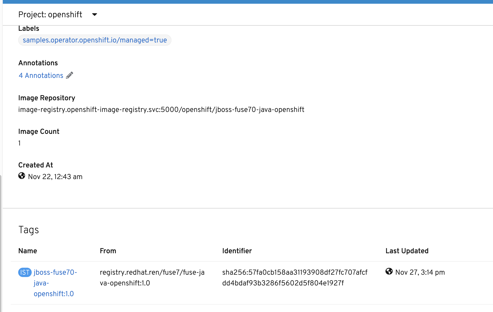

# openshift 4.2  operator sample

## 尝试配置一下sample operator
```bash
## sample operator
# oc patch -n openshift-cluster-samples-operator  configs.samples.operator.openshift.io cluster -p '{"items[0]":{"spec":{"managementState":"Removed"}}}'  --type=merge
# oc patch -n openshift-cluster-samples-operator  configs.samples.operator.openshift.io cluster -p '{"spec":{"managementState":"Managed"}}'  --type=merge

oc patch -n openshift-cluster-samples-operator  configs.samples.operator.openshift.io cluster -p '{"spec":{"samplesRegistry":"registry.redhat.ren"}}'  --type=merge

bash is.patch.sh
```
要等一段很长的时间，这个配置才会生效。


## 其他备忘

```bash
yum -y install unzip git

git clone https://github.com/openshift/cluster-samples-operator

cd ./cluster-samples-operator/tmp/build

bash library-sync.sh

# find . -type f | xargs egrep "(containerImage: |image: |value: |\"name\": )"| sed 's/\\n/\n/g'| sed 's/^.*containerImage: //' | sed 's/^.*image: //' | sed 's/^.*value: //' | sed 's/^.*\"name\": //' | egrep "^.*\.(io|com|org|net)/.*:.*" | sed s/"'"//g | sed 's/\"//g' | sort | uniq 

find ./ -type f | xargs egrep -oh "\"[[:alnum:]|\.]+\.(io|com|org|net)/[[:graph:]]+\"$" | sed 's/\"//g'

```

