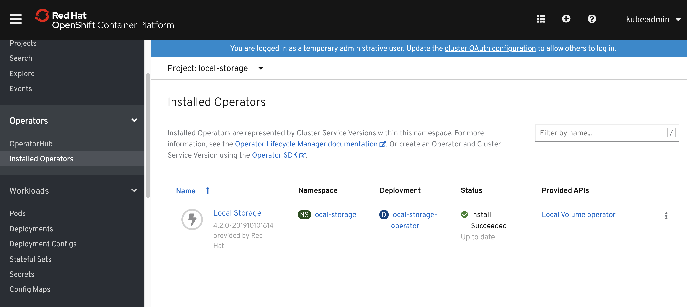
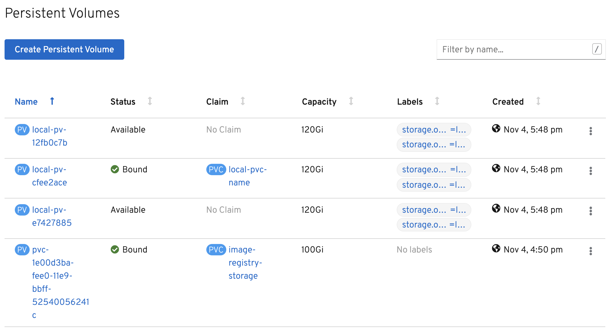
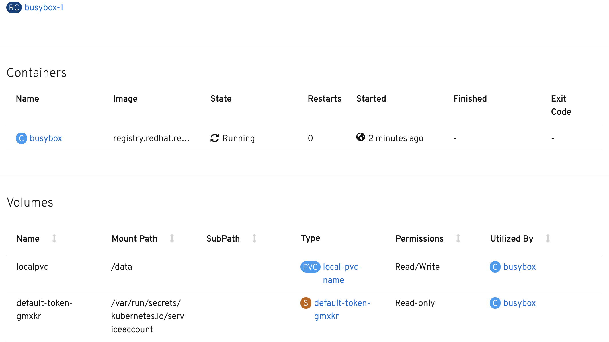

# openshift 4.2 local volume 配置和操作

本文基于 https://github.com/wangzheng422/docker_env/blob/master/redhat/ocp4/4.2.disconnect.operator.md

我们先来重新创建集群，给每个节点，增加一个数据盘

https://docs.openshift.com/container-platform/4.2/storage/persistent-storage/persistent-storage-local.html#local-volume-cr_persistent-storage-local

```bash
cd /data/ocp4

# finally, we can start install :)
# 你可以一口气把虚拟机都创建了，然后喝咖啡等着。
# 从这一步开始，到安装完毕，大概30分钟。
virt-install --name=ocp4-bootstrap --vcpus=4 --ram=8192 \
--disk path=/data/kvm/ocp4-bootstrap.qcow2,bus=virtio,size=120 \
--disk path=/data/kvm/ocp4-bootstrap-02.qcow2,bus=virtio,size=120 \
--os-variant rhel8.0 --network network=openshift4,model=virtio \
--boot menu=on --cdrom /data/ocp4/bootstrap-static.iso   

# 想登录进coreos一探究竟？那么这么做
# ssh core@192.168.7.12 
# journalctl -b -f -u bootkube.service

virt-install --name=ocp4-master0 --vcpus=4 --ram=32768 \
--disk path=/data/kvm/ocp4-master0.qcow2,bus=virtio,size=120 \
--disk path=/data/kvm/ocp4-master0-02.qcow2,bus=virtio,size=120 \
--os-variant rhel8.0 --network network=openshift4,model=virtio \
--boot menu=on --cdrom /data/ocp4/master-0.iso 

# ssh core@192.168.7.13

virt-install --name=ocp4-master1 --vcpus=4 --ram=32768 \
--disk path=/data/kvm/ocp4-master1.qcow2,bus=virtio,size=120 \
--disk path=/data/kvm/ocp4-master1-02.qcow2,bus=virtio,size=120 \
--os-variant rhel8.0 --network network=openshift4,model=virtio \
--boot menu=on --cdrom /data/ocp4/master-1.iso 

virt-install --name=ocp4-master2 --vcpus=4 --ram=32768 \
--disk path=/data/kvm/ocp4-master2.qcow2,bus=virtio,size=120 \
--disk path=/data/kvm/ocp4-master2-02.qcow2,bus=virtio,size=120 \
--os-variant rhel8.0 --network network=openshift4,model=virtio \
--boot menu=on --cdrom /data/ocp4/master-2.iso 

virt-install --name=ocp4-worker0 --vcpus=4 --ram=32768 \
--disk path=/data/kvm/ocp4-worker0.qcow2,bus=virtio,size=120 \
--disk path=/data/kvm/ocp4-worker0-02.qcow2,bus=virtio,size=120 \
--os-variant rhel8.0 --network network=openshift4,model=virtio \
--boot menu=on --cdrom /data/ocp4/worker-0.iso 

virt-install --name=ocp4-worker1 --vcpus=4 --ram=32768 \
--disk path=/data/kvm/ocp4-worker1.qcow2,bus=virtio,size=120 \
--disk path=/data/kvm/ocp4-worker1-02.qcow2,bus=virtio,size=120 \
--os-variant rhel8.0 --network network=openshift4,model=virtio \
--boot menu=on --cdrom /data/ocp4/worker-1.iso 

virt-install --name=ocp4-worker2 --vcpus=4 --ram=32768 \
--disk path=/data/kvm/ocp4-worker2.qcow2,bus=virtio,size=120 \
--disk path=/data/kvm/ocp4-worker2-02.qcow2,bus=virtio,size=120 \
--os-variant rhel8.0 --network network=openshift4,model=virtio \
--boot menu=on --cdrom /data/ocp4/worker-2.iso 

```

然后我们来激活local volume operator。之后我们来弄一个yaml，来配置数据卷

```bash

oc new-project local-storage

# enable local volume operator in this project

oc adm policy add-cluster-role-to-user cluster-admin system:serviceaccount:local-storage:local-storage-operator

cat << EOF > test-local-volume.yaml
apiVersion: "local.storage.openshift.io/v1"
kind: "LocalVolume"
metadata:
  name: "local-disks"
  namespace: "local-storage" 
spec:
  storageClassDevices:
    - storageClassName: "localblock-sc"
      volumeMode: Block  
      devicePaths: 
        - /dev/vdb
EOF
oc apply -f test-local-volume.yaml

cat << EOF > test-local-volume.yaml
apiVersion: "local.storage.openshift.io/v1"
kind: "LocalVolume"
metadata:
  name: "local-disks"
  namespace: "local-storage" 
spec:
  storageClassDevices:
    - storageClassName: "local-sc"
      volumeMode: Filesystem 
      fsType: xfs 
      devicePaths: 
        - /dev/vdb
EOF
oc apply -f test-local-volume.yaml

oc get all -n local-storage

oc get pv

cat << EOF > test-local-pvc.yaml
kind: PersistentVolumeClaim
apiVersion: v1
metadata:
  name: local-pvc-name 
spec:
  accessModes:
  - ReadWriteOnce
  volumeMode: Filesystem 
  resources:
    requests:
      storage: 20Gi 
  storageClassName: local-sc 
EOF
oc apply -f test-local-pvc.yaml

cat << EOF > test-local-dc.yaml
kind: DeploymentConfig
apiVersion: apps.openshift.io/v1
metadata:
  name: busybox
  namespace: local-storage
  labels:
    run: busybox
spec:
  replicas: 1
  template:
    metadata:
      labels:
        run: busybox
    spec:
      containers:
        - name: busybox
          image: 'registry.redhat.ren/docker.io/busybox:1.28.0-glibc'
          command:
            - sleep
            - '36000'
          volumeMounts:
            - name: localpvc 
              mountPath: "/data" 
      volumes:
        - name: localpvc
          persistentVolumeClaim:
            claimName: local-pvc-name 
EOF
oc apply -f test-local-dc.yaml
```






以下是其他的实验

```bash

scp /etc/crts/redhat.ren.crt 192.168.7.11:/root/ocp4/

oc project openshift-config
oc create configmap ca.for.registry \
    --from-file=registry.redhat.ren=/root/ocp4/redhat.ren.crt
oc delete configmap ca.for.registry
oc patch image.config.openshift.io/cluster -p '{"spec":{"additionalTrustedCA":{"name":"ca.for.registry"}}}'  --type=merge
oc edit image.config.openshift.io/cluster 
oc patch image.config.openshift.io/cluster -p '{"spec":{"registrySources":{"insecureRegistries":[{"registry.redhat.ren"}]}}}'  --type=merge

oc get image.config.openshift.io/cluster -o json
oc get image.config.openshift.io/cluster -o yaml

oc get configs.samples.operator.openshift.io -n openshift-cluster-samples-operator cluster -o yaml

oc patch -n openshift-cluster-samples-operator  configs.samples.operator.openshift.io cluster -p '{"spec":{"samplesRegistry":"registry.redhat.ren/registry.redhat.io"}}'  --type=merge

oc patch -n openshift-cluster-samples-operator  configs.samples.operator.openshift.io cluster -p '{"spec":{"samplesRegistry":""}}'  --type=merge


```
```yaml
apiVersion: config.openshift.io/v1
kind: Image
metadata:
  annotations:
    release.openshift.io/create-only: "true"
  creationTimestamp: "2019-10-23T05:40:26Z"
  generation: 3
  name: cluster
  resourceVersion: "4988235"
  selfLink: /apis/config.openshift.io/v1/images/cluster
  uid: 9db0d455-f557-11e9-b356-525400bc66d3
spec:
  additionalTrustedCA:
    name: ca.for.registry
  registrySources:
    insecureRegistries:
    - registry.redhat.ren
status:
  internalRegistryHostname: image-registry.openshift-image-registry.svc:5000
```
```bash


oc debug node/****

oc get configs.samples.operator.openshift.io -n openshift-cluster-samples-operator

```

