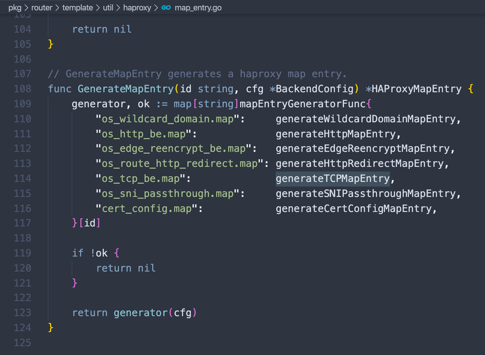

# 定制haproxy支持tcp

https://docs.openshift.com/container-platform/3.11/install_config/router/customized_haproxy_router.html#go-template-actions

https://www.haproxy.com/blog/introduction-to-haproxy-maps/

https://access.redhat.com/solutions/3495011

https://blog.zhaw.ch/icclab/openshift-custom-router-with-tcpsni-support/
```bash

oc project openshift-ingress

oc create configmap customrouter --from-file=haproxy-config.template

oc set volume dc/router --add --overwrite \
    --name=config-volume \
    --mount-path=/var/lib/haproxy/conf/custom \
    --source='{"configMap": { "name": "customrouter"}}'

oc set env dc/router \
    TEMPLATE_FILE=/var/lib/haproxy/conf/custom/haproxy-config.template

cat << EOF > route.yaml
kind: Route
apiVersion: route.openshift.io/v1
metadata:
  name: demo
  namespace: demo
  annotations:
    openshift.io/host.generated: 'true'
spec:
  to:
    kind: Service
    name: my-cluster-kafka-bootstrap
  port:
    targetPort: 9001
  tls:
    termination: passthrough
    insecureEdgeTerminationPolicy: None
  wildcardPolicy: None
EOF


```

分析源码，我们可以看到，openshift router还是对haproxy做了扩展的，那些map文件，都是router的扩展生成的，目的是对接endpoint，绕过service。所以我们想做tcp转发，可以借助sni-tcp来实现tcp转发。

