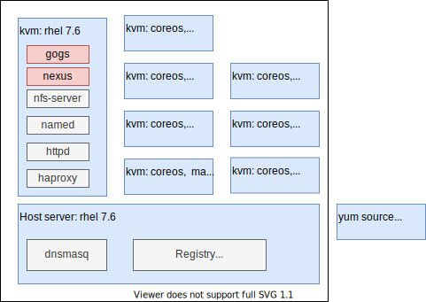

# containered cloud-native (ccn) roadshow 离线部署

CCN是一个不错的演示openshift之上，ci/cd, cloud-native, istio, serverless的演示教材，教学的内容非常丰富。

第一个模块，着重讲解如何拆分单体应用，以及拆分的应用如何上云。
  
第二个模块，讲解如何在线debug, 如何监控上云的应用

第三个模块，应用转换到服务网格service mesh/istio架构

第四个模块，应用使用无服务架构serverless/knative架构开发

培训过程视频
- The Containers and Cloud-Native Roadshow Dev Track - Module 1
  - [bilibili](https://www.bilibili.com/read/cv6713699)
  - [xigua](https://www.ixigua.com/6847386067889455630)
  - [youtube](https://www.youtube.com/playlist?list=PLRL8GgzNL9SgeODjqT1aU8ya95KfwgElv)
  - [教材](https://1drv.ms/b/s!AqLmU5b8zhHEoxFp6ef1t5bpS7Dy?e=oi3IKg)
- The Containers and Cloud-Native Roadshow Dev Track - Module 2
  - [bilibili](https://www.bilibili.com/read/cv6868575)
  - [xigua](https://www.ixigua.com/6848440375573479949)
  - [youtube](https://www.youtube.com/watch?v=Kr4dwz2QaeU&list=PLRL8GgzNL9SjG9YZRxKHhCdN5XK32QpOA)
  - [教材](https://1drv.ms/b/s!AqLmU5b8zhHEoxOzpffwSNSetYtI?e=ktNJoo)
- The Containers and Cloud-Native Roadshow Dev Track - Module 3
  - [bilibili](https://www.bilibili.com/read/cv6888587)
  - [xigua](https://www.ixigua.com/6849151451068006919)
  - [youtube](https://www.youtube.com/watch?v=rxzr3Tjydzw&list=PLRL8GgzNL9SjBFitrp01FUNmrSODdG8P8)
  - [教材](https://1drv.ms/b/s!AqLmU5b8zhHEoxJ8hlmSHS_KEo1D?e=eWLsnl)
- The Containers and Cloud-Native Roadshow Dev Track - Module 4
  - [bilibili](https://www.bilibili.com/read/cv6889572)
  - [xigua](https://www.ixigua.com/6850338543265382915)
  - [youtube](https://www.youtube.com/watch?v=bSFIDNVJ4hc&list=PLRL8GgzNL9SjIYb-08yjJt0r1JdUIz4yC)
  - [教材](https://1drv.ms/b/s!AqLmU5b8zhHEoxQ07qUqKv15U3nT?e=jhBexg)
  
安装过程视频
- [bilibili](https://www.bilibili.com/video/BV1CZ4y1u7Nf/)
- [xigua](https://www.ixigua.com/6853055649233043979/)
- [youtube](https://youtu.be/Arzo0slgD5I)

不过 upstream 的 CCN 是基于 rh demo system 的，必须在线，这里就做了一个离线的版本，供给客户离线使用。

## 离线部署架构描述

本次CCN离线，是基于ocp 4.4.7制作。一共有4个module。

做CCN的离线，主要有以下3部分工作
- github 离线
- maven, npm 离线
- 需要的镜像离线

在实验室的部署架构如下，供参考：



可以看到，与标准的部署架构没什么区别，就是在helper节点上面，加了gogs, nexus。

## 安装介质下载

请到如下的链接，下载安装介质，注意，这个安装介质是基于ocp 4.4.7 制作。
- 链接: https://pan.baidu.com/s/1f3EcbojFss5cDDQBPBzA-A  密码: 1jun

由于上传的时候，安装5G大小切分，下载以后，合并使用如下的命令范例：
```bash
cat registry.?? > registry.tgz
```

百度盘上还会有补丁文件，比如，当有一个 agnosticd.zip 文件时, 这个就是补丁文件，上传到helper上，替换ocp4.tgz解压缩出来的同名文件即可。

## 教材修订

教材根据上游的项目做了修订，主要是源代码，为了应对纯离线环境，做了小的修改。如果在教学现场，发现有步骤做不下去，多半是因为离线环境的问题，请参考教学视频录像，里面会有如何绕过离线环境问题的技巧。

## 基础ocp4.4环境的部署细节

- 按照离线的方法安装ocp4，里面要特别注意要有这些安装细节
  - 打上离线registries.conf的补丁
  - 打上local image registry ca的补丁
  - 配置image registry
  - 配置sample operator，并打上image stream的补丁
  - 部署离线operator hub

## ccn for ocp-4.4 安装步骤

建议用独立的ocp4集群来安装ccn教材，因为ccn教材会全局的激活多个operator，这些operator也许对集群中的其他环境有影响。

```bash
# on helper
# deploy gogs
export LOCAL_REG='registry.redhat.ren:5443/'
# export LOCAL_REG=''
# gogs_var_date='2020-07-06'
podman stop gogs
podman rm -fv gogs
cd /data/ccn
rm -rf /data/ccn/gogs
podman run -d --name gogs-fs --entrypoint "tail" ${LOCAL_REG}docker.io/wangzheng422/gogs-fs:2020-07-17-1412 -f /dev/null
podman cp gogs-fs:/gogs.tgz /data/ccn/
tar zxf gogs.tgz
podman rm -fv gogs-fs

podman run -d --name=gogs -p 10022:22 -p 10080:3000 -v /data/ccn/gogs:/data:Z -v /data/ccn/gogs/resolv.conf:/etc/resolv.conf:Z ${LOCAL_REG}docker.io/gogs/gogs

podman stop gogs
podman rm -fv gogs


# deploy nexus
mkdir -p /data/ccn/nexus
cd /data/ccn
rm -rf /data/ccn/nexus
podman run -d --name nexus-fs --entrypoint "tail" ${LOCAL_REG}docker.io/wangzheng422/nexus-fs:2020-07-20-0320 -f /dev/null
podman cp nexus-fs:/nexus.tgz /data/ccn/
tar zxf nexus.tgz ./
podman rm -fv nexus-fs

chown -R 200:root /data/ccn/nexus

podman run -d -p 8081:8081 -it --name nexus -v /data/ccn/nexus:/nexus-data:Z ${LOCAL_REG}docker.io/sonatype/nexus3:latest

podman stop nexus
podman rm -fv nexus


# deploy etherpad

mkdir -p /data/ccn/etherpad
chown -R 5001 /data/ccn/etherpad

podman run -d -p 9001:9001 -it --name etherpad -v /data/ccn/etherpad:/opt/etherpad-lite/var:z ${LOCAL_REG}docker.io/etherpad/etherpad:latest

podman stop etherpad
podman rm -fv etherpad


# agnosticd on helper

mkdir -p /data/pip3
cd /data/pip3
podman create --name swap registry.redhat.ren:5443/docker.io/wangzheng422/base-fs:pip3-whl-2020-07-05 ls
podman cp swap:/wheelhouse.tar.gz - > wheelhouse.tar.gz
tar vxf wheelhouse.tar.gz
podman rm -fv swap

pip3 install --user --upgrade -r wheelhouse/requirements.txt --no-index --find-links wheelhouse

# yum downgrade ansible-2.8.12-1.el7ae

# 安装ccn环境的参数
oc login -u kubeadmin
# oc login -u system:admin
# TARGET_HOST="bastion.rhte-b5c8.openshiftworkshop.com"
OCP_USERNAME="system:admin"
WORKLOAD="ocp4-workload-ccnrd"
GUID=b5c8
USER_COUNT=2
MODULE_TYPE="m1;m2;m3;m4"
SSH_KEY=~/.ssh/id_rsa
WZH_SUBDOMIN_BASE=base.ocp4.redhat.ren
WZH_REGISTRY_SERVER=registry.redhat.ren:5443
WZH_GOGS_SERVER=gogs.redhat.ren:10080

# create users
BASE_DIR="/root/ocp4"
mkdir -p ${BASE_DIR}
cd ${BASE_DIR}
/bin/rm -f ${BASE_DIR}/htpasswd
touch ${BASE_DIR}/htpasswd

for i in $(seq 1 $USER_COUNT)
do 
    htpasswd -Bb ${BASE_DIR}/htpasswd user${i} redhat
done

oc create secret generic htpasswd --from-file=${BASE_DIR}/htpasswd -n openshift-config

oc apply -f - <<EOF
apiVersion: config.openshift.io/v1
kind: OAuth
metadata:
  name: cluster
spec:
  identityProviders:
  - name: Local Password
    mappingMethod: claim
    type: HTPasswd
    htpasswd:
      fileData:
        name: htpasswd
EOF

# oc delete secret htpasswd -n openshift-config

# 以下是安装步骤
# a TARGET_HOST is specified in the command line, without using an inventory file
cd /root/ocp4/agnosticd/ansible
ansible-playbook -i localhost, ./configs/ocp-workloads/ocp-workload.yml \
    -e"ansible_ssh_private_key_file=${SSH_KEY}" \
    -e"ansible_user=root" \
    -e"ocp_username=${OCP_USERNAME}" \
    -e"ocp_workload=${WORKLOAD}" \
    -e"silent=False" \
    -e"guid=${GUID}" \
    -e"num_users=${USER_COUNT}" \
    -e"user_count=${USER_COUNT}" \
    -e"module_type=${MODULE_TYPE}" \
    -e"wzh_registry_server=${WZH_REGISTRY_SERVER}" \
    -e"wzh_gogs_server=${WZH_GOGS_SERVER}" \
    -e"ansible_python_interpreter=/usr/bin/python3" \
    -e"subdomain_base=${WZH_SUBDOMIN_BASE}" \
    -v \
    -e"ACTION=create"


# 以下是删除ccn的步骤，注意大部分的operator不会删除。
# a TARGET_HOST is specified in the command line, without using an inventory file
ansible-playbook -i localhost, ./configs/ocp-workloads/ocp-workload.yml \
    -e"ansible_ssh_private_key_file=${SSH_KEY}" \
    -e"ansible_user=root" \
    -e"ocp_username=${OCP_USERNAME}" \
    -e"ocp_workload=${WORKLOAD}" \
    -e"silent=False" \
    -e"guid=${GUID}" \
    -e"num_users=${USER_COUNT}" \
    -e"user_count=${USER_COUNT}" \
    -e"module_type=${MODULE_TYPE}" \
    -e"wzh_registry_server=${WZH_REGISTRY_SERVER}" \
    -e"wzh_gogs_server=${WZH_GOGS_SERVER}" \
    -e"ansible_python_interpreter=/usr/bin/python3" \
    -e"subdomain_base=${WZH_SUBDOMIN_BASE}" \
    -v \
    -e"ACTION=remove"


```


## 其他备忘

```bash
yum install -y wget jq

# Keycloak credentials: admin / 2kBdjDwcZK94
# STACK_ID: stacksq1xbet4os1uioep

```
manully patch image stream
- jenkins:2 to registry.redhat.ren/ocp4/openshift4@sha256:*****
- jenkins:latest to registry.redhat.ren/ocp4/openshift4@sha256:*****

tips
```bash
oc get istio-io -n opentlc-mgr-tutorial

oc new-build -i openshift/redhat-openjdk18-openshift:1.5 --binary --name=inventory-quarkus -l app=inventory-quarkus

npm run nodeshift --  --dockerImage=registry.redhat.ren:5443/docker.io/wangzheng422/cloudnative-workspaces-quarkus  --imageTag=nodejs-10-2020-07-16-2155

```

todo
- PPT