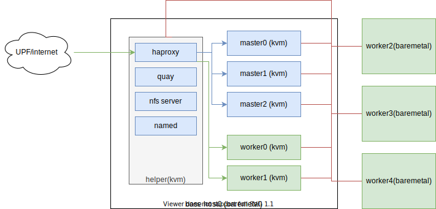
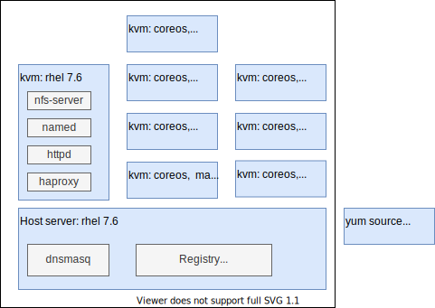
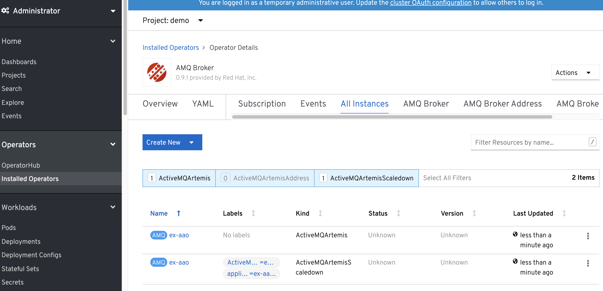

# openshift 4.6 静态IP离线 baremetal 安装，包含operator hub

安装过程视频
- 

本文描述ocp4.6在baremental(kvm模拟)上面，静态ip安装的方法。包括operator hub步骤。





## 离线安装包下载

ocp4.3的离线安装包下载和3.11不太一样，按照如下方式准备。另外，由于默认的baremental是需要dhcp, pxe环境的，那么需要准备一个工具机，上面有dhcp, tftp, haproxy等工具，另外为了方便项目现场工作，还准备了ignition文件的修改工具，所以离线安装包需要一些其他第三方的工具。

https://github.com/wangzheng422/ocp4-upi-helpernode 这个工具，是创建工具机用的。

https://github.com/wangzheng422/filetranspiler 这个工具，是修改ignition文件用的。

打包好的安装包，在这里下载，百度盘下载链接，版本是4.6.5:

链接: https://pan.baidu.com/s/1k795VAunxGIhUKvXtSbtCQ  密码: 50vn

其中包括如下类型的文件：
- ocp4.tgz  这个文件包含了iso等安装介质，以及各种安装脚本，全部下载的镜像列表等。需要复制到宿主机，以及工具机上去。
- registry.tgz  这个文件也是docker image registry的仓库打包文件。但是要运行其他operator的话，需要先补充镜像。按照这里操作： https://github.com/wangzheng422/docker_env/blob/master/redhat/ocp4/4.5/4.5.add.image.md .
- rhel-data.tgz 这个文件是 rhel 7 主机的yum更新源，这么大是因为里面有gpu, epel等其他的东西。这个包主要用于安装宿主机，工具机，以及作为计算节点的rhel。

合并这些切分文件，使用类似如下的命令
```bash
cat registry.?? > registry.tgz
```
## 在外网云主机上面准备离线安装源

准备离线安装介质的文档，已经转移到了这里：[4.6.build.dist.md](4.6.build.dist.md)

## 宿主机准备

本次实验，是在一个32C， 256G 的主机上面，用很多个虚拟机安装测试。所以先准备这个宿主机。

如果是多台宿主机，记得一定要调整时间配置，让这些宿主机的时间基本一致，否则证书会出问题。

主要的准备工作有
- 配置yum源
- 配置dns
- 安装镜像仓库
- 配置vnc环境
- 配置kvm需要的网络
- 创建helper kvm
- 配置一个haproxy，从外部导入流量给kvm

以上准备工作，dns部分需要根据实际项目环境有所调整。

本次的宿主机是一台rhel7
```bash
cat << EOF >>  /etc/hosts
127.0.0.1 registry.ocp4.redhat.ren
EOF

# 准备yum更新源
mkdir /etc/yum.repos.d.bak
mv /etc/yum.repos.d/* /etc/yum.repos.d.bak
cat << EOF > /etc/yum.repos.d/remote.repo
[remote]
name=RHEL FTP
baseurl=ftp://127.0.0.1/data
enabled=1
gpgcheck=0

EOF

yum clean all
yum repolist

yum -y install byobu htop 

systemctl disable --now firewalld

# 配置registry
mkdir -p /etc/crts/ && cd /etc/crts
openssl req \
   -newkey rsa:2048 -nodes -keyout redhat.ren.key \
   -x509 -days 3650 -out redhat.ren.crt -subj \
   "/C=CN/ST=GD/L=SZ/O=Global Security/OU=IT Department/CN=*.ocp4.redhat.ren" \
   -config <(cat /etc/pki/tls/openssl.cnf \
        <(printf "[SAN]\nsubjectAltName=DNS:registry.ocp4.redhat.ren,DNS:*.ocp4.redhat.ren,DNS:*.redhat.ren"))

/bin/cp -f /etc/crts/redhat.ren.crt /etc/pki/ca-trust/source/anchors/
update-ca-trust extract

cd /data
mkdir -p /data/registry
# tar zxf registry.tgz
yum -y install podman docker-distribution pigz skopeo
# pigz -dc registry.tgz | tar xf -
cat << EOF > /etc/docker-distribution/registry/config.yml
version: 0.1
log:
  fields:
    service: registry
storage:
    cache:
        layerinfo: inmemory
    filesystem:
        rootdirectory: /data/4.6.5/registry
    delete:
        enabled: true
http:
    addr: :5443
    tls:
       certificate: /etc/crts/redhat.ren.crt
       key: /etc/crts/redhat.ren.key
compatibility:
  schema1:
    enabled: true
EOF
# systemctl restart docker
# systemctl stop docker-distribution
systemctl enable --now docker-distribution
# systemctl restart docker-distribution
# podman login registry.redhat.ren:5443 -u a -p a

# firewall-cmd --permanent --add-port=5443/tcp
# firewall-cmd --reload

# 加载更多的镜像
# 解压缩 ocp4.tgz
bash add.image.load.sh /data/4.6.5/install.image 'registry.ocp4.redhat.ren:5443'

# https://github.com/christianh814/ocp4-upi-helpernode/blob/master/docs/quickstart.md

# 准备vnc环境

yum -y install tigervnc-server tigervnc gnome-terminal gnome-session \
  gnome-classic-session gnome-terminal nautilus-open-terminal \
  control-center liberation-mono-fonts google-noto-sans-cjk-fonts \
  google-noto-sans-fonts fonts-tweak-tool

yum install -y    qgnomeplatform   xdg-desktop-portal-gtk \
  NetworkManager-libreswan-gnome   PackageKit-command-not-found \
  PackageKit-gtk3-module   abrt-desktop   at-spi2-atk   at-spi2-core   \
  avahi   baobab   caribou   caribou-gtk2-module   caribou-gtk3-module   \
  cheese   compat-cheese314   control-center   dconf   empathy   eog   \
  evince   evince-nautilus   file-roller   file-roller-nautilus   \
  firewall-config   firstboot   fprintd-pam   gdm   gedit   glib-networking   \
  gnome-bluetooth   gnome-boxes   gnome-calculator   gnome-classic-session   \
  gnome-clocks   gnome-color-manager   gnome-contacts   gnome-dictionary   \
  gnome-disk-utility   gnome-font-viewer   gnome-getting-started-docs   \
  gnome-icon-theme   gnome-icon-theme-extras   gnome-icon-theme-symbolic   \
  gnome-initial-setup   gnome-packagekit   gnome-packagekit-updater   \
  gnome-screenshot   gnome-session   gnome-session-xsession   \
  gnome-settings-daemon   gnome-shell   gnome-software   gnome-system-log   \
  gnome-system-monitor   gnome-terminal   gnome-terminal-nautilus   \
  gnome-themes-standard   gnome-tweak-tool   nm-connection-editor   orca   \
  redhat-access-gui   sane-backends-drivers-scanners   seahorse   \
  setroubleshoot   sushi   totem   totem-nautilus   vinagre   vino   \
  xdg-user-dirs-gtk   yelp

yum install -y    cjkuni-uming-fonts   dejavu-sans-fonts   \
  dejavu-sans-mono-fonts   dejavu-serif-fonts   gnu-free-mono-fonts   \
  gnu-free-sans-fonts   gnu-free-serif-fonts   \
  google-crosextra-caladea-fonts   google-crosextra-carlito-fonts   \
  google-noto-emoji-fonts   jomolhari-fonts   khmeros-base-fonts   \
  liberation-mono-fonts   liberation-sans-fonts   liberation-serif-fonts   \
  lklug-fonts   lohit-assamese-fonts   lohit-bengali-fonts   \
  lohit-devanagari-fonts   lohit-gujarati-fonts   lohit-kannada-fonts   \
  lohit-malayalam-fonts   lohit-marathi-fonts   lohit-nepali-fonts   \
  lohit-oriya-fonts   lohit-punjabi-fonts   lohit-tamil-fonts   \
  lohit-telugu-fonts   madan-fonts   nhn-nanum-gothic-fonts   \
  open-sans-fonts   overpass-fonts   paktype-naskh-basic-fonts   \
  paratype-pt-sans-fonts   sil-abyssinica-fonts   sil-nuosu-fonts   \
  sil-padauk-fonts   smc-meera-fonts   stix-fonts   \
  thai-scalable-waree-fonts   ucs-miscfixed-fonts   vlgothic-fonts   \
  wqy-microhei-fonts   wqy-zenhei-fonts

vncpasswd

cat << EOF > ~/.vnc/xstartup
#!/bin/sh
unset SESSION_MANAGER
unset DBUS_SESSION_BUS_ADDRESS
vncconfig &
gnome-session &
EOF
chmod +x ~/.vnc/xstartup

vncserver :1 -geometry 1280x800
# 如果你想停掉vnc server，这么做
vncserver -kill :1

# firewall-cmd --permanent --add-port=6001/tcp
# firewall-cmd --permanent --add-port=5901/tcp
# firewall-cmd --reload

# connect vnc at port 5901
# export DISPLAY=:1

# https://www.cyberciti.biz/faq/how-to-install-kvm-on-centos-7-rhel-7-headless-server/

# 配置kvm环境
yum -y install qemu-kvm libvirt libvirt-python libguestfs-tools virt-install virt-viewer virt-manager

systemctl enable libvirtd
systemctl start libvirtd

lsmod | grep -i kvm
brctl show
virsh net-list
virsh net-dumpxml default

# 创建实验用虚拟网络

cat << EOF >  /data/virt-net.xml
<network>
  <name>openshift4</name>
  <forward mode='nat'>
    <nat>
      <port start='1024' end='65535'/>
    </nat>
  </forward>
  <bridge name='openshift4' stp='on' delay='0'/>
  <domain name='openshift4'/>
  <ip address='192.168.7.1' netmask='255.255.255.0'>
  </ip>
</network>
EOF

virsh net-define --file virt-net.xml
virsh net-autostart openshift4
virsh net-start openshift4

# restore back
virsh net-destroy openshift4
virsh net-undefine openshift4

# 创建工具机

mkdir -p /data/kvm
cd /data/kvm

lvremove -f datavg/helperlv
lvcreate -y -L 430G -n helperlv datavg

virt-install --name="ocp4-aHelper" --vcpus=2 --ram=4096 \
--disk path=/dev/datavg/helperlv,device=disk,bus=virtio,format=raw \
--os-variant centos7.0 --network network=openshift4,model=virtio \
--boot menu=on --location /data/kvm/rhel-server-7.8-x86_64-dvd.iso \
--initrd-inject helper-ks.cfg --extra-args "inst.ks=file:/helper-ks.cfg" 

# virt-viewer --domain-name ocp4-aHelper
# virsh start ocp4-aHelper
# virsh list --all

# start chrony/ntp server on host
cat << EOF > /etc/chrony.conf
driftfile /var/lib/chrony/drift
makestep 1.0 3
rtcsync
allow 192.0.0.0/8
local stratum 10
logdir /var/log/chrony
EOF
systemctl enable --now chronyd
# systemctl restart chronyd
chronyc tracking
chronyc sources -v
chronyc sourcestats -v
chronyc makestep

```
## 工具机准备

以下是在工具机里面，进行的安装操作。

主要的操作有
- 配置yum源
- 运行ansible脚本，自动配置工具机
- 上传定制的安装配置文件
- 生成ignition文件

```bash

sed -i 's/#UseDNS yes/UseDNS no/g' /etc/ssh/sshd_config
systemctl restart sshd

# cat << EOF > /root/.ssh/config
# StrictHostKeyChecking no
# UserKnownHostsFile=/dev/null
# EOF

# in helper node
mkdir /etc/yum.repos.d.bak
mv /etc/yum.repos.d/* /etc/yum.repos.d.bak/
cat << EOF > /etc/yum.repos.d/remote.repo
[remote]
name=RHEL FTP
baseurl=ftp://192.168.7.1/data
enabled=1
gpgcheck=0

EOF

yum clean all
yum repolist

yum -y install ansible git unzip podman python36

mkdir -p /data/ocp4/
# scp ocp4.tgz to /data
cd /data
tar zvxf ocp4.tgz
cd /data/ocp4

# 这里使用了一个ansible的项目，用来部署helper节点的服务。
# https://github.com/wangzheng422/ocp4-upi-helpernode
unzip ocp4-upi-helpernode.zip
# 这里使用了一个ignition文件合并的项目，用来帮助自定义ignition文件。
# https://github.com/wangzheng422/filetranspiler
podman load -i filetranspiler.tgz

# 接下来，我们使用ansible来配置helper节点，装上各种openshift集群需要的服务
# 根据现场环境，修改 ocp4-upi-helpernode-master/vars-static.yaml
cd /data/ocp4/ocp4-upi-helpernode-master
ansible-playbook -e @vars-static.yaml -e staticips=true tasks/main.yml

# try this:
/usr/local/bin/helpernodecheck

mkdir -p /data/install

# GOTO image registry host
# copy crt files to helper node
scp /etc/crts/redhat.ren.crt root@192.168.7.11:/data/install/
scp /etc/crts/redhat.ren.key root@192.168.7.11:/data/install/

# GO back to help node
/bin/cp -f /data/install/redhat.ren.crt /etc/pki/ca-trust/source/anchors/
update-ca-trust extract

# 定制ignition
cd /data/install

# 根据现场环境，修改 install-config.yaml
# 至少要修改ssh key， 还有 additionalTrustBundle，这个是镜像仓库的csr 

# vi install-config.yaml 
cat << EOF > /data/install/install-config.yaml 
apiVersion: v1
baseDomain: redhat.ren
compute:
- hyperthreading: Enabled
  name: worker
  replicas: 3
controlPlane:
  hyperthreading: Enabled
  name: master
  replicas: 3
metadata:
  name: ocp4
networking:
  clusterNetworks:
  - cidr: 10.254.0.0/16
    hostPrefix: 24
  networkType: OpenShiftSDN
  serviceNetwork:
  - 172.30.0.0/16
platform:
  none: {}
pullSecret: '{"auths":{"registry.ocp4.redhat.ren:5443": {"auth": "ZHVtbXk6ZHVtbXk=","email": "noemail@localhost"},"registry.ppa.redhat.ren:5443": {"auth": "ZHVtbXk6ZHVtbXk=","email": "noemail@localhost"}}}'
sshKey: |
$( cat /root/.ssh/helper_rsa.pub | sed 's/^/   /g' )
additionalTrustBundle: |
$( cat /data/install/redhat.ren.crt | sed 's/^/   /g' )
imageContentSources:
- mirrors:
  - registry.ocp4.redhat.ren:5443/ocp4/openshift4
  source: quay.io/openshift-release-dev/ocp-release
- mirrors:
  - registry.ocp4.redhat.ren:5443/ocp4/openshift4
  source: quay.io/openshift-release-dev/ocp-v4.0-art-dev
EOF

cd /data/install/
/bin/rm -rf *.ign .openshift_install_state.json auth bootstrap manifests master*[0-9] worker*[0-9] 

openshift-install create ignition-configs --dir=/data/install

cd /data/ocp4/ocp4-upi-helpernode-master
# 我们来为每个主机，复制自己版本的ign，并复制到web server的目录下
ansible-playbook -e @vars-static.yaml -e staticips=true tasks/ign.yml
# 如果对每个主机有自己ign的独特需求，在这一步，去修改ign。

# 以下操作本来是想设置网卡地址，但是实践发现是不需要的。
# 保留在这里，是因为他可以在安装的时候注入文件，非常有用。
# mkdir -p bootstrap/etc/sysconfig/network-scripts/
# cat <<EOF > bootstrap/etc/sysconfig/network-scripts/ifcfg-ens3
# DEVICE=ens3
# BOOTPROTO=none
# ONBOOT=yes
# IPADDR=192.168.7.12
# NETMASK=255.255.255.0
# GATEWAY=192.168.7.1
# DNS=192.168.7.11
# DNS1=192.168.7.11
# DNS2=192.168.7.1
# DOMAIN=redhat.ren
# PREFIX=24
# DEFROUTE=yes
# IPV6INIT=no
# EOF
# filetranspiler -i bootstrap.ign -f bootstrap -o bootstrap-static.ign
# /bin/cp -f bootstrap-static.ign /var/www/html/ignition/

# 我们为每个节点创建各自的iso文件
cd /data/ocp4/ocp4-upi-helpernode-master
ansible-playbook -e @vars-static.yaml -e staticips=true tasks/iso.yml

```
## 回到宿主机

本来，到了这一步，就可以开始安装了，但是我们知道coreos装的时候，要手动输入很长的命令行，实际操作的时候，那是不可能输入对的，输入错一个字符，安装就失败，要重启，重新输入。。。

为了避免这种繁琐的操作，参考网上的做法，我们就需要为每个主机定制iso了。好在，之前的步骤，我们已经用ansible创建了需要的iso，我们把这些iso复制到宿主机上，就可以继续了。

这里面有一个坑，我们是不知道主机的网卡名称的，只能先用coreos iso安装启动一次，进入单用户模式以后，ip a 来查看以下，才能知道，一般来说，是ens3。

另外，如果是安装物理机，disk是哪个，也需要上述的方法，来看看具体的盘符。另外，推荐在物理机上安装rhel 8 来测试一下物理机是不是支持coreos。物理机安装的时候，遇到不写盘的问题，可以尝试添加启动参数： ignition.firstboot=1

```bash
# on kvm host

export KVM_DIRECTORY=/data/kvm

cd ${KVM_DIRECTORY}
scp root@192.168.7.11:/data/install/*.iso ${KVM_DIRECTORY}/

create_lv() {
    var_name=$1
    lvremove -f datavg/$var_name
    lvcreate -y -L 120G -n $var_name datavg
    # wipefs --all --force /dev/datavg/$var_name
}

create_lv bootstraplv
create_lv master0lv
create_lv master1lv
create_lv master2lv
create_lv worker0lv
create_lv worker1lv
create_lv worker2lv

# finally, we can start install :)
# 你可以一口气把虚拟机都创建了，然后喝咖啡等着。
# 从这一步开始，到安装完毕，大概30分钟。
virt-install --name=ocp4-bootstrap --vcpus=4 --ram=8192 \
--disk path=/dev/datavg/bootstraplv,device=disk,bus=virtio,format=raw \
--os-variant rhel8.0 --network network=openshift4,model=virtio \
--boot menu=on --cdrom ${KVM_DIRECTORY}/rhcos_install-bootstrap.iso   

# 想登录进coreos一探究竟？那么这么做
# ssh core@192.168.7.12 
# journalctl -b -f -u bootkube.service

virt-install --name=ocp4-master0 --vcpus=4 --ram=16384 \
--disk path=/dev/datavg/master0lv,device=disk,bus=virtio,format=raw \
--os-variant rhel8.0 --network network=openshift4,model=virtio \
--boot menu=on --cdrom ${KVM_DIRECTORY}/rhcos_install-master-0.iso 

# ssh core@192.168.7.13

virt-install --name=ocp4-master1 --vcpus=4 --ram=16384 \
--disk path=/dev/datavg/master1lv,device=disk,bus=virtio,format=raw \
--os-variant rhel8.0 --network network=openshift4,model=virtio \
--boot menu=on --cdrom ${KVM_DIRECTORY}/rhcos_install-master-1.iso 

virt-install --name=ocp4-master2 --vcpus=4 --ram=16384 \
--disk path=/dev/datavg/master2lv,device=disk,bus=virtio,format=raw \
--os-variant rhel8.0 --network network=openshift4,model=virtio \
--boot menu=on --cdrom ${KVM_DIRECTORY}/rhcos_install-master-2.iso 

virt-install --name=ocp4-worker0 --vcpus=4 --ram=32768 \
--disk path=/dev/datavg/worker0lv,device=disk,bus=virtio,format=raw \
--os-variant rhel8.0 --network network=openshift4,model=virtio \
--boot menu=on --cdrom ${KVM_DIRECTORY}/rhcos_install-worker-0.iso 

virt-install --name=ocp4-worker1 --vcpus=4 --ram=16384 \
--disk path=/dev/datavg/worker1lv,device=disk,bus=virtio,format=raw \
--os-variant rhel8.0 --network network=openshift4,model=virtio \
--boot menu=on --cdrom ${KVM_DIRECTORY}/rhcos_install-worker-1.iso 

virt-install --name=ocp4-worker2 --vcpus=4 --ram=16384 \
--disk path=/dev/datavg/worker2lv,device=disk,bus=virtio,format=raw \
--os-variant rhel8.0 --network network=openshift4,model=virtio \
--boot menu=on --cdrom ${KVM_DIRECTORY}/rhcos_install-worker-2.iso 

# on workstation
# open http://192.168.7.11:9000/
# to check

# if you want to stop or delete vm, try this
virsh list --all
virsh destroy ocp4-bootstrap
virsh destroy ocp4-master0 
virsh destroy ocp4-master1 
virsh destroy ocp4-master2 
virsh destroy ocp4-worker0 
virsh destroy ocp4-worker1 
virsh destroy ocp4-worker2
virsh undefine ocp4-bootstrap
virsh undefine ocp4-master0 
virsh undefine ocp4-master1 
virsh undefine ocp4-master2 
virsh undefine ocp4-worker0 
virsh undefine ocp4-worker1 
virsh undefine ocp4-worker2

```

## 在工具机上面

这个时候，安装已经自动开始了，我们只需要回到工具机上静静的观察就可以了。

在bootstrap和装master阶段，用这个命令看进度。
```bash
cd ~/ocp4
export KUBECONFIG=/data/install/auth/kubeconfig
echo "export KUBECONFIG=/data/install/auth/kubeconfig" >> ~/.bashrc
oc completion bash | sudo tee /etc/bash_completion.d/openshift > /dev/null

cd /data/install
openshift-install wait-for bootstrap-complete --log-level debug

```
一切正常的话，会看到这个。


有时候证书会过期，验证方法是登录 bootstrap, 看看过期时间。如果确定过期，要清除所有的openshift-install生成配置文件的缓存，重新来过。
```bash
echo | openssl s_client -connect localhost:6443 | openssl x509 -noout -text | grep Not
```
一般来说，如果在openshift-install这一步之前，按照文档，删除了缓存文件，就不会出现过期的现象。
```bash
oc get nodes
```
这个时候，只能看到master，是因为worker的csr没有批准。如果虚拟机是一口气创建的，那么多半不会遇到下面的问题。
```bash
oc get csr
```
会发现有很多没有被批准的


批准之
```bash
yum -y install jq
oc get csr | grep -v Approved
oc get csr -ojson | jq -r '.items[] | select(.status == {} ) | .metadata.name' | xargs oc adm certificate approve
# oc get csr -o name | xargs oc adm certificate approve
```
然后worker 节点cpu飙高，之后就能看到worker了。


等一会，会看到这个，就对了。


上面的操作完成以后，就可以完成最后的安装了
```bash
openshift-install wait-for install-complete --log-level debug
# here is the output
# INFO To access the cluster as the system:admin user when using 'oc', run 'export KUBECONFIG=/data/install/auth/kubeconfig'
# INFO Access the OpenShift web-console here: https://console-openshift-console.apps.ocp4.redhat.ren
# INFO Login to the console with user: "kubeadmin", and password: "7MXaT-vqouq-UukdG-uzNEi"
```
我们的工具机是带nfs的，那么就配置高档一些的nfs存储吧，不要用emptydir
```bash
bash /data/ocp4/ocp4-upi-helpernode-master/files/nfs-provisioner-setup.sh

# oc edit configs.imageregistry.operator.openshift.io
# 修改 storage 部分
# storage:
#   pvc:
#     claim:
oc patch configs.imageregistry.operator.openshift.io cluster -p '{"spec":{"managementState": "Managed","storage":{"pvc":{"claim":""}}}}' --type=merge

oc patch configs.imageregistry.operator.openshift.io cluster -p '{"spec":{"managementState": "Removed"}}' --type=merge

oc get clusteroperator image-registry

oc get configs.imageregistry.operator.openshift.io cluster -o yaml

# 把imagepruner给停掉
# https://bugzilla.redhat.com/show_bug.cgi?id=1852501#c24
# oc patch imagepruner.imageregistry/cluster --patch '{"spec":{"suspend":true}}' --type=merge
# oc -n openshift-image-registry delete jobs --all

oc get configs.samples.operator.openshift.io/cluster -o yaml

oc patch configs.samples.operator.openshift.io/cluster -p '{"spec":{"managementState": "Managed"}}' --type=merge

oc patch configs.samples.operator.openshift.io/cluster -p '{"spec":{"managementState": "Unmanaged"}}' --type=merge

oc patch configs.samples.operator.openshift.io/cluster -p '{"spec":{"managementState": "Removed"}}' --type=merge

```
配置一下本地的dns ( 把 *.apps.ocp4.redhat.ren 配置成 192.168.7.11 ) ，指向工具机的haproxy，打开浏览器就能访问管理界面了


## chrony/NTP 设置
在 ocp 4.6 里面，需要设定ntp同步，我们之前ansible脚本，已经创建好了ntp的mco配置，把他打到系统里面就好了。

```bash
oc apply -f /data/ocp4/ocp4-upi-helpernode-master/machineconfig/

```

## Operator Hub 离线安装

https://docs.openshift.com/container-platform/4.2/operators/olm-restricted-networks.html

https://github.com/operator-framework/operator-registry

https://www.cnblogs.com/ericnie/p/11777384.html?from=timeline&isappinstalled=0

https://access.redhat.com/documentation/en-us/openshift_container_platform/4.2/html-single/images/index

operator hub 准备分2个层次，一个是本文章描述的，制作operator hub的离线资源，并镜像operator 镜像。做到这一步，能够在离线部署的ocp4.2上，看到operator hub，并且能够部署operator。但是如果要用operator来部署要用的组件，那么operator会再去下载镜像，这个层次的镜像，也需要离线部署，但是由于每个operator需要的镜像都不一样，也没有统一的地方进行描述，所以需要各个项目现场，根据需要另外部署，本项目会尽量多的下载需要的镜像，但是目前无法避免遗漏。


```bash
# on helper node， 在工具机上
cd /data/ocp4

# scp /etc/crts/redhat.ren.crt 192.168.7.11:/root/ocp4/
# https://docs.openshift.com/container-platform/4.4/builds/setting-up-trusted-ca.html
oc project openshift-config
oc create configmap ca.for.registry -n openshift-config \
    --from-file=registry.ocp4.redhat.ren..5443=/data/install/redhat.ren.crt
# 如果你想删除这个config map，这么做
# oc delete configmap ca.for.registry
oc patch image.config.openshift.io/cluster -p '{"spec":{"additionalTrustedCA":{"name":"ca.for.registry"}}}'  --type=merge
# oc patch image.config.openshift.io/cluster -p '{"spec":{"registrySources":{"insecureRegistries":["registry.redhat.ren"]}}}'  --type=merge
oc get image.config.openshift.io/cluster -o yaml

# 以下这个步骤是官网文档要做的，实践中发现，disconnected环境不需要
# oc patch OperatorHub cluster --type json -p '[{"op": "add", "path": "/spec/disableAllDefaultSources", "value": true}]'
# 如果你不小心还是照着官网做了，用如下步骤删掉
# oc patch OperatorHub cluster --type json  -p '[{"op": "remove", "path": "/spec/disableAllDefaultSources"}]'

oc patch OperatorHub cluster --type json \
    -p '[{"op": "add", "path": "/spec/disableAllDefaultSources", "value": true}]'

oc get OperatorHub cluster -o yaml

# yum -y install python36
# 根据项目现场情况，调整参数，运行以下命令，生成配置文件，指向内网镜像仓库
cd /data/ocp4/
bash image.registries.conf.sh registry.ocp4.redhat.ren:5443

# 由于某些ocp 4.2的更新机制，以下操作会触发集群更新，
# 集群节点会逐个重启，集群组件也会逐个重启，请等待集群重启完毕。
oc apply -f ./99-worker-container-registries.yaml -n openshift-config
oc apply -f ./99-master-container-registries.yaml -n openshift-config

# ！！！正常情况，以下操作不需要！！！
# 以下操作，删除mirror镜像信息，也会触发集群更新操作，请等待集群重启完毕
oc delete -f ./99-worker-container-registries.yaml -n openshift-config
oc delete -f ./99-master-container-registries.yaml -n openshift-config

watch oc get machineconfigpools

watch oc get node
```
从监控界面，能看到节点在升级，重启。


```bash

# on helper node

# params for operator hub images
export var_date='2020.11.23.0135'
echo $var_date
export var_major_version='4.6'
echo ${var_major_version}

export LOCAL_REG='registry.ocp4.redhat.ren:5443'

# 如果想看到redhat的operator，这样做
# 镜像源在 docker.io/wangzheng422/operator-catalog:redhat-$var_major_version-$var_date
# 后面的参数，去build.dist.sh文件里面，查看
# var_date 和 var_major_version 参数得到
cat <<EOF > redhat-operator-catalog.yaml
apiVersion: operators.coreos.com/v1alpha1
kind: CatalogSource
metadata:
  name: redhat-operators-catalog
  namespace: openshift-marketplace
spec:
  displayName: Red Hat Operators
  sourceType: grpc
  image: ${LOCAL_REG}/ocp4/operator-catalog:redhat-${var_major_version}-${var_date}
  publisher: Red Hat
EOF
oc create -f redhat-operator-catalog.yaml

# 如果想看到certified的operator，这样做
# 镜像源在 docker.io/wangzheng422/operator-catalog:certified-$var_major_version-$var_date
# 后面的参数，去build.dist.sh文件里面，查看
# var_date 和 var_major_version 参数得到
cat <<EOF > certified-operator-catalog.yaml
apiVersion: operators.coreos.com/v1alpha1
kind: CatalogSource
metadata:
  name: certified-operator-catalog
  namespace: openshift-marketplace
spec:
  displayName: Certified Operators
  sourceType: grpc
  image: ${LOCAL_REG}/ocp4/operator-catalog:certified-${var_major_version}-${var_date}
  publisher: Red Hat
EOF
oc create -f certified-operator-catalog.yaml

# 如果想看到community的operator，这样做
# 镜像源在 docker.io/wangzheng422/operator-catalog:community-$var_major_version-$var_date
# 后面的参数，去build.dist.sh文件里面，查看
# var_date 和 var_major_version 参数得到
cat <<EOF > community-operator-catalog.yaml
apiVersion: operators.coreos.com/v1alpha1
kind: CatalogSource
metadata:
  name: community-operator-catalog
  namespace: openshift-marketplace
spec:
  displayName: Community Operator
  sourceType: grpc
  image: ${LOCAL_REG}/ocp4/operator-catalog:community-${var_major_version}-${var_date}
  publisher: Red Hat
EOF
oc create -f community-operator-catalog.yaml

cat <<EOF > marketplace-operator-catalog.yaml
apiVersion: operators.coreos.com/v1alpha1
kind: CatalogSource
metadata:
  name: redhat-marketplace-catalog
  namespace: openshift-marketplace
spec:
  displayName: Red Hat Marketplace
  sourceType: grpc
  image: ${LOCAL_REG}/ocp4/operator-catalog:redhat-marketplace-${var_major_version}-${var_date}
  publisher: Red Hat
EOF
oc create -f marketplace-operator-catalog.yaml

# 想删除这些离线operator hub，就这样做。
# find . -name "*-operator-catalog.yaml" -exec oc delete -f {} \;

oc get pods -n openshift-marketplace
oc get catalogsource -n openshift-marketplace
oc get packagemanifest -n openshift-marketplace

```
能看到operator 列表


部署一个operator也能成功





```bash
# set master and worker combine
# https://github.com/openshift-telco/openshift4x-poc/blob/master/MASTER-WORKER-COMBINED.md
oc edit schedulers cluster
# apiVersion: config.openshift.io/v1
# kind: Scheduler
# metadata:
# name: cluster
# spec:
#     mastersSchedulable: true

```
## 其他链接

https://www.cnblogs.com/ericnie/p/11764124.html


## 以下是参考材料
https://blog.openshift.com/openshift-4-2-disconnected-install/

https://blog.openshift.com/openshift-4-bare-metal-install-quickstart/

https://github.com/christianh814/ocp4-upi-helpernode#ocp4-upi-helper-node-playbook

https://github.com/openshift/cluster-samples-operator/blob/master/manifests/image-references

https://github.com/e-minguez/ocp4-upi-bm-pxeless-staticips/blob/master/docs/12-post-installation.md

https://www.openshift.com/blog/deploying-a-upi-environment-for-openshift-4-1-on-vms-and-bare-metal
