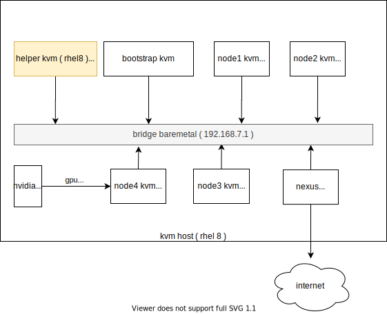
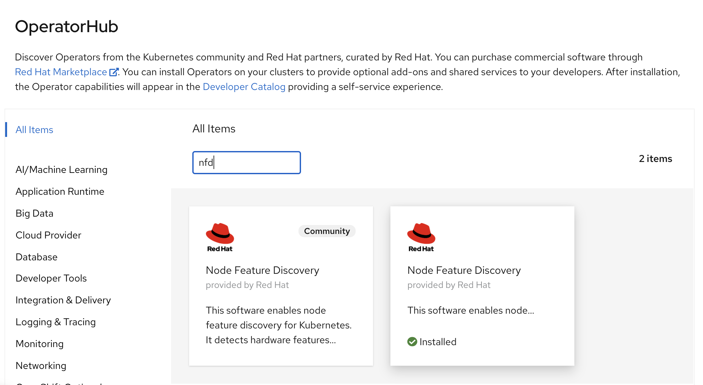
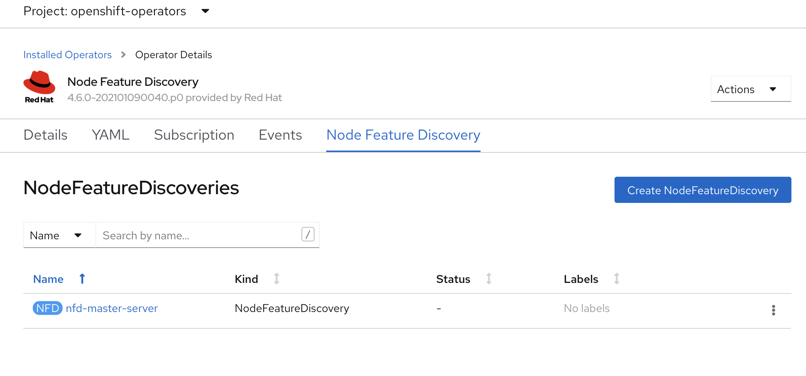
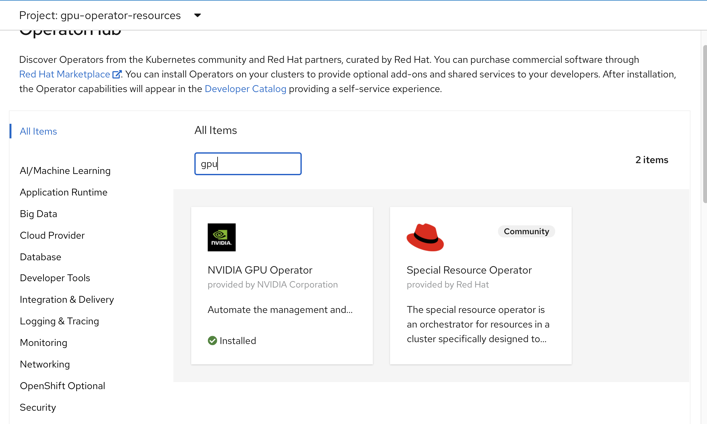
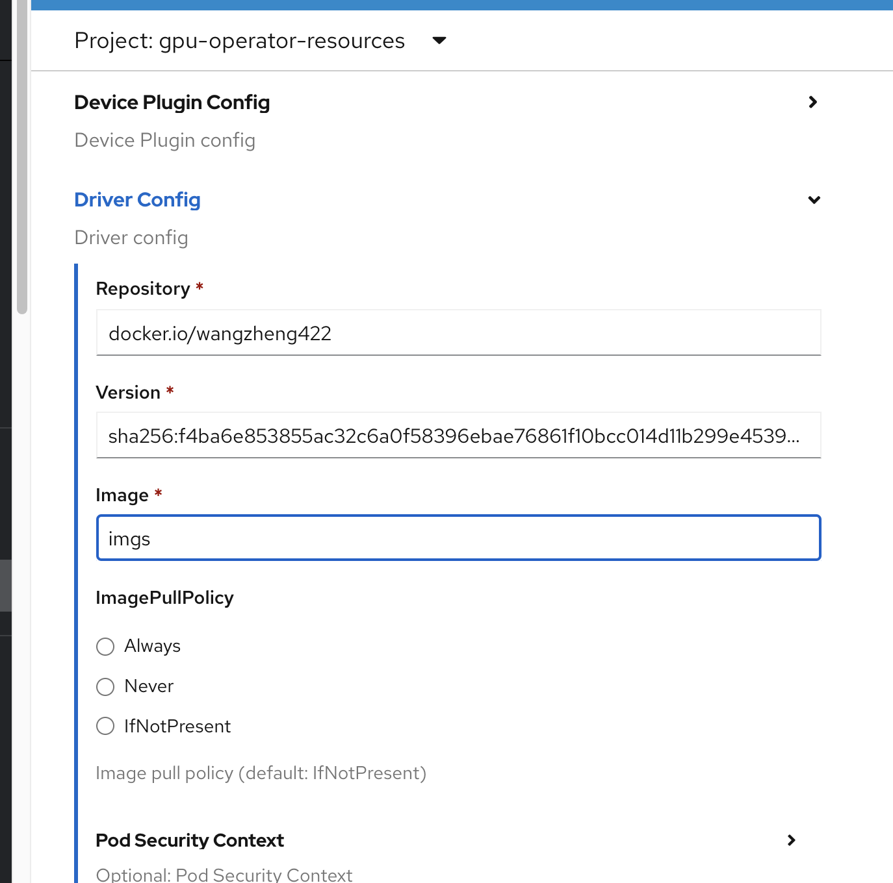
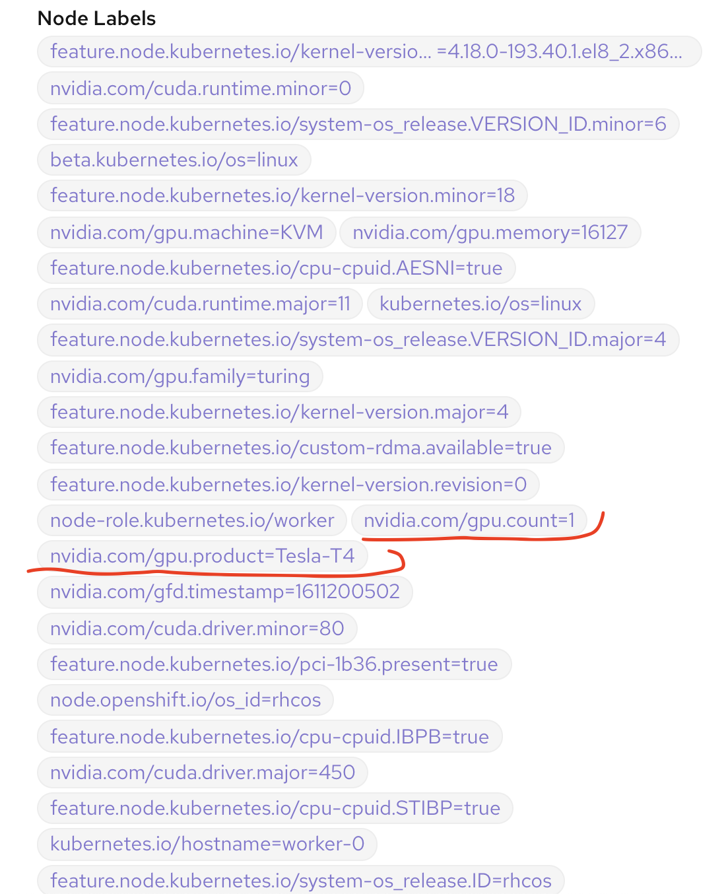

# nvidia gpu for openshift 4.6 disconnected 英伟达GPU离线安装

## 简介

本次实验是openshift编译GPU场景的一部分，主要关注于nvidia gpu如何在离线的情况下安装。关于如何gpu passthrough到kvm，模拟边缘gpu主机，见[这个文档](./4.6.disconnect.bm.upi.static.ip.on.rhel8.edge.md)

以下是讲解视频

[<kbd></kbd>](https://www.bilibili.com/video/BV1CX4y1P7AK/)

- [bilibili](https://www.bilibili.com/video/BV1CX4y1P7AK/)
- [xigua](https://www.ixigua.com/6920198650257900039)
- [youtube](https://youtu.be/hrHsUdfZEBY)

以下是本次实验的架构图:



## 制作 rhel8 repo / 安装源
nvidia gpu operator需要在线下载包，来编译driver，那么在离线场景，我们就需要先准备一个rhel8 的 repo。
```bash
export PROXY="127.0.0.1:18801"

subscription-manager --proxy=$PROXY release --list

subscription-manager --proxy=$PROXY release --set=8

subscription-manager --proxy=$PROXY repos --disable="*"
subscription-manager --proxy=$PROXY repos \
    --enable="rhel-8-for-x86_64-baseos-rpms" \
    --enable="rhel-8-for-x86_64-baseos-source-rpms" \
    --enable="rhel-8-for-x86_64-appstream-rpms" \
    --enable="rhel-8-for-x86_64-supplementary-rpms" \
    --enable="codeready-builder-for-rhel-8-x86_64-rpms" \
    --enable="rhocp-4.6-for-rhel-8-x86_64-rpms" \
    --enable="rhel-8-for-x86_64-baseos-eus-rpms" \
    # endline

mkdir -p /data/dnf/gaps
cd /data/dnf/gaps

subscription-manager --proxy=$PROXY release --set=8.2

dnf install -y modulemd-tools 

# 注意，这里需要的包，需要先部署以下gpu operator，然后看看driver的日志，里面装什么包，这里替换成相应的包，不用版本的gpu operator要求不同，所以这里的包也不一样。
/bin/rm -rf /data/dnf/gaps/*
dnf download --resolve --releasever=8.2 --alldeps \
--repo rhel-8-for-x86_64-baseos-eus-rpms,rhocp-4.6-for-rhel-8-x86_64-rpms,rhel-8-for-x86_64-baseos-rpms,rhel-8-for-x86_64-appstream-rpms \
kernel-headers-4.18.0-193.40.1.el8_2.x86_64 kernel-devel-4.18.0-193.40.1.el8_2.x86_64 kernel-core-4.18.0-193.40.1.el8_2.x86_64 systemd-udev-239-31.el8_2.2.x86_64 elfutils-libelf.x86_64 elfutils-libelf-devel.x86_64 

# https://access.redhat.com/solutions/4907601
createrepo ./
repo2module . \
    --module-name foo \
    --module-stream devel \
    --module-version 123 \
    --module-context f32
createrepo_mod .

```
现在，本机的 /data/dnf/gaps/ 目录，就是repo的目录了，做一个ftp服务，把他暴露出去就好了。具体方法，[参考这里](/redhat/rhel/rhel8.build.kernel.repo.cache.md)

## 修改英伟达驱动镜像 / nvidia driver image
默认 nvidia gpu driver pod 是需要联网下载各种包的，这里面还设计到订阅，非常麻烦，而且离线无法使用。

我们刚才已经做了一个离线的repo仓库，那么我们就需要定制以下driver image，让他直接用离线的repo仓库就好了。

```bash

# driver image
# nvidia-driver-daemonset
podman pull nvcr.io/nvidia/driver@sha256:324e9dc265dec320207206aa94226b0c8735fd93ce19b36a415478c95826d934
podman image tag 0c8de6e01f39 nv-driver

# you can test the driver image, like this:
# podman run --rm -it --entrypoint='/bin/bash' localhost/nv-driver 

mkdir -p /data/gpu/
cd /data/gpu
# /bin/rm -rf /etc/yum.repos.d/* 
export YUMIP="192.168.7.1"
cat << EOF > /data/gpu/remote.repo
[gaps]
name=gaps
baseurl=ftp://${YUMIP}/dnf/gaps
enabled=1
gpgcheck=0

EOF

cat << EOF > /data/gpu/Dockerfile
FROM localhost/nv-driver

RUN /bin/rm -rf /etc/yum.repos.d/* 
COPY remote.repo /etc/yum.repos.d/remote.repo

EOF

var_date=$(date '+%Y-%m-%d-%H%M')
echo $var_date

buildah bud --format=docker -t docker.io/wangzheng422/imgs:nvidia-gpu-driver-$var_date -f Dockerfile .

# podman run --rm -it --entrypoint='/bin/bash' docker.io/wangzheng422/imgs:nvidia-gpu-driver-2021-01-21-0942

buildah push docker.io/wangzheng422/imgs:nvidia-gpu-driver-$var_date
echo "docker.io/wangzheng422/imgs:nvidia-gpu-driver-$var_date"

# docker.io/wangzheng422/imgs:nvidia-gpu-driver-2021-01-21-0942
# docker.io/wangzheng422/imgs@sha256:f4ba6e853855ac32c6a0f58396ebae76861f10bcc014d11b299e4539bb4c5c6a

```
好了，我们最后制作好的镜像，就是 docker.io/wangzheng422/imgs@sha256:f4ba6e853855ac32c6a0f58396ebae76861f10bcc014d11b299e4539bb4c5c6a 。 为什么用sha256呢，因为nvidian gpu opator里面的参数要求。

## 开始离线安装gpu operator

参考nvidia官方的[安装文档](https://docs.nvidia.com/datacenter/kubernetes/openshift-on-gpu-install-guide/)

首先，我们要安装 node feature discovery (nfd)，注意了，目前nfd只能扫描独立worker节点，所以 3 节点的edge模式，是不支持的。


然后给nfd做一个配置，直接点击创建就可以，什么都不用改，注意namespace是openshift-operator


接下来，我们先创建一个namespace gpu-operator-resources, 然后安装 nvidia gpu operator


我们在gpu operator里面，创建一个cluster policy，注意要修改他的参数


最后我们从 node label 上就能看见识别到的 gpu 了。


## 测试一下

```bash
# 先按照官方文档试试
oc project gpu-operator-resources

POD_NAME=$(oc get pods -o json | jq -r '.items[] | select( .metadata.name | contains("nvidia-driver-daemonset") ) | .metadata.name' | head )

oc exec -it $POD_NAME -- nvidia-smi 
# Thu Jan 21 04:12:36 2021
# +-----------------------------------------------------------------------------+
# | NVIDIA-SMI 450.80.02    Driver Version: 450.80.02    CUDA Version: 11.0     |
# |-------------------------------+----------------------+----------------------+
# | GPU  Name        Persistence-M| Bus-Id        Disp.A | Volatile Uncorr. ECC |
# | Fan  Temp  Perf  Pwr:Usage/Cap|         Memory-Usage | GPU-Util  Compute M. |
# |                               |                      |               MIG M. |
# |===============================+======================+======================|
# |   0  Tesla T4            On   | 00000000:05:00.0 Off |                  Off |
# | N/A   27C    P8    14W /  70W |      0MiB / 16127MiB |      0%      Default |
# |                               |                      |                  N/A |
# +-------------------------------+----------------------+----------------------+

# +-----------------------------------------------------------------------------+
# | Processes:                                                                  |
# |  GPU   GI   CI        PID   Type   Process name                  GPU Memory |
# |        ID   ID                                                   Usage      |
# |=============================================================================|
# |  No running processes found                                                 |
# +-----------------------------------------------------------------------------+

# 我们再启动个应用试试
# https://nvidia.github.io/gpu-operator/

# https://ngc.nvidia.com/catalog/containers/nvidia:tensorrt
# 我们按照这个官方文档，做一个测试镜像

# goto helper
cd /data/ocp4

cat << EOF > /data/ocp4/gpu.yaml
---
kind: Deployment
apiVersion: apps/v1
metadata:
  annotations:
  name: demo1
  labels:
    app: demo1
spec:
  replicas: 1
  selector:
    matchLabels:
      app: demo1
  template:
    metadata:
      labels:
        app: demo1
    spec:
      nodeSelector:
        kubernetes.io/hostname: 'worker-0'
      restartPolicy: Always
      containers:
        - name: demo1
          image: "k8s.gcr.io/cuda-vector-add:v0.1"

EOF
oc project demo
oc apply -f gpu.yaml
# [Vector addition of 50000 elements]
# Copy input data from the host memory to the CUDA device
# CUDA kernel launch with 196 blocks of 256 threads
# Copy output data from the CUDA device to the host memory
# Test PASSED
# Done

oc delete -f gpu.yaml

# on build host
# https://ngc.nvidia.com/catalog/containers/nvidia:tensorrt
# podman run -it nvcr.io/nvidia/tensorrt:20.12-py3
mkdir -p /data/gpu
cd /data/gpu
cat << EOF > /data/gpu/Dockerfile
FROM docker.io/wangzheng422/imgs:tensorrt-ljj

CMD tail -f /dev/null

EOF
var_date=$(date '+%Y-%m-%d-%H%M')
echo $var_date

buildah bud --format=docker -t docker.io/wangzheng422/imgs:tensorrt-ljj-$var_date -f Dockerfile .

buildah push docker.io/wangzheng422/imgs:tensorrt-ljj-$var_date
echo "docker.io/wangzheng422/imgs:tensorrt-ljj-$var_date"

# docker.io/wangzheng422/imgs:tensorrt-ljj-2021-01-21-1151

# go back to helper node
cat << EOF > /data/ocp4/gpu.yaml
---
kind: Deployment
apiVersion: apps/v1
metadata:
  annotations:
  name: demo1
  labels:
    app: demo1
spec:
  replicas: 1
  selector:
    matchLabels:
      app: demo1
  template:
    metadata:
      labels:
        app: demo1
    spec:
      nodeSelector:
        kubernetes.io/hostname: 'worker-0'
      restartPolicy: Always
      containers:
        - name: demo1
          image: docker.io/wangzheng422/imgs:tensorrt-ljj-2021-01-21-1151

EOF
oc project demo
oc apply -f gpu.yaml

# oc rsh into the pod, run sample program using gpu
# cd tensorrt/bin/
# ./sample_mnist
# you will see this correct result
# &&&& PASSED TensorRT.sample_mnist # ./sample_mnist

oc delete -f gpu.yaml


```

## reference

https://www.openshift.com/blog/simplifying-deployments-of-accelerated-ai-workloads-on-red-hat-openshift-with-nvidia-gpu-operator

https://www.openshift.com/blog/how-to-use-entitled-image-builds-to-build-drivercontainers-with-ubi-on-openshift

https://access.redhat.com/solutions/5232901

https://docs.nvidia.com/datacenter/kubernetes/openshift-on-gpu-install-guide/

https://access.redhat.com/solutions/4907601

## 以下弯路

```bash
# add ubi support
cat << EOF > /etc/yum.repos.d/ubi.repo
[ubi-8-baseos]
name=ubi-8-baseos
baseurl=https://cdn-ubi.redhat.com/content/public/ubi/dist/ubi8/8/x86_64/baseos/os
enabled=1
gpgcheck=1

[ubi-8-appstream]
name=ubi-8-appstream
baseurl=https://cdn-ubi.redhat.com/content/public/ubi/dist/ubi8/8/x86_64/appstream/os
enabled=1
gpgcheck=1

[ubi-8-codeready-builder]
name=ubi-8-codeready-builder
baseurl=https://cdn-ubi.redhat.com/content/public/ubi/dist/ubi8/8/x86_64/codeready-builder/os/
enabled=1
gpgcheck=1

EOF

cd /data/dnf
dnf reposync -m --download-metadata --delete -n


cat << EOF > /data/ocp4/gpu.yaml
---
kind: Deployment
apiVersion: apps/v1
metadata:
  annotations:
  name: demo1
  labels:
    app: demo1
spec:
  replicas: 1
  selector:
    matchLabels:
      app: demo1
  template:
    metadata:
      labels:
        app: demo1
    spec:
      nodeSelector:
        kubernetes.io/hostname: 'worker-0'
      restartPolicy: Always
      containers:
        - name: demo1
          image: nvidia/cuda:11.1.1-devel-centos8

EOF
oc project demo
oc apply -f gpu.yaml

oc delete -f gpu.yaml

cat << EOF > /data/gpu/Dockerfile
FROM nvcr.io/nvidia/tensorrt:20.12-py3

RUN /opt/tensorrt/python/python_setup.sh
RUN /opt/tensorrt/install_opensource.sh 
RUN /opt/tensorrt/install_opensource.sh -b master
# RUN cd /workspace/tensorrt/samples && make -j4

CMD tail -f /dev/null

EOF

```