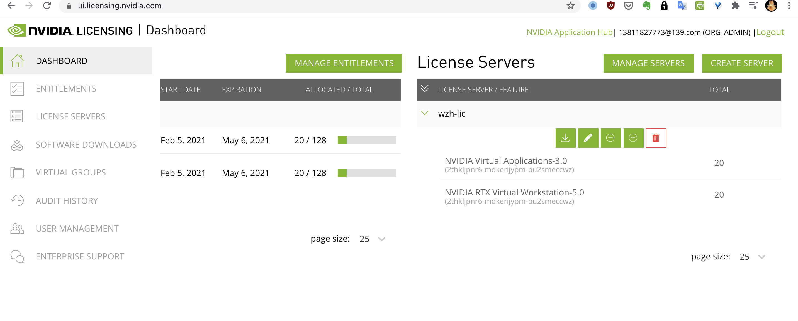
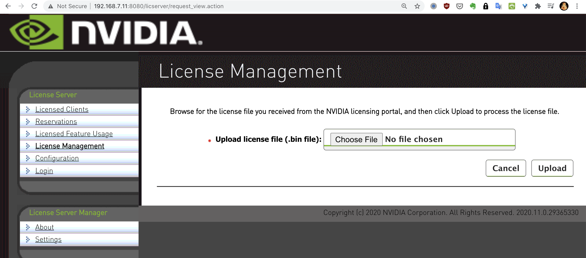
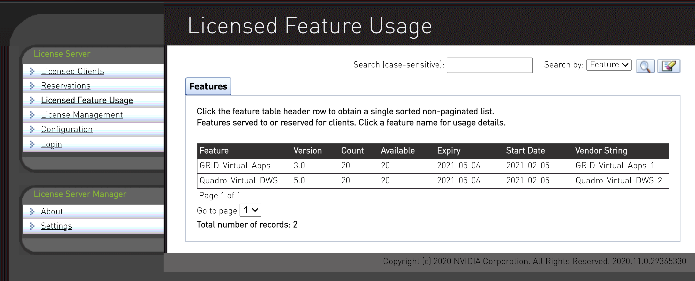

# openshift 4.6 with nvidia vGPU 安装

## nvidia license server安装

访问 https://nvid.nvidia.com/dashboard

下载软件


解压缩 NVIDIA-ls-Linux-2020.11.0.29365330.zip ， 参考里面的 license server的说明书，我们在helper kvm里面，安装license server

```bash
# on helper
yum install -y java
java -version
# openjdk version "1.8.0_275"
# OpenJDK Runtime Environment (build 1.8.0_275-b01)
# OpenJDK 64-Bit Server VM (build 25.275-b01, mixed mode)

# /usr/lib/jvm/java-1.8.0-openjdk-1.8.0.275.b01-1.el8_3.x86_64/jre/

sudo groupadd tomcat
useradd -d /usr/share/tomcat -g tomcat -M -s /bin/false tomcat
sudo mkdir -p /usr/share/tomcat

# wget https://apache.osuosl.org/tomcat/tomcat-10/v10.0.2/bin/apache-tomcat-10.0.2.tar.gz
# wget https://mirrors.ocf.berkeley.edu/apache/tomcat/tomcat-9/v9.0.43/bin/apache-tomcat-9.0.43.tar.gz
sudo tar xvf apache-tomcat-*.tar.gz -C /usr/share/tomcat --strip-components=1

cd /usr/share/tomcat
chown -R tomcat: /usr/share/tomcat
sudo chgrp -R tomcat /usr/share/tomcat
sudo chmod -R g+r conf
sudo chmod g+x conf
sudo chown -R tomcat webapps work temp logs

cat << EOF > /etc/systemd/system/tomcat.service 
[Unit]
Description=Apache Tomcat Server
After=network.target

[Service]
Type=forking

Environment=JAVA_HOME=/usr/lib/jvm/jre
Environment=CATALINA_PID=/usr/share/tomcat/temp/tomcat.pid
Environment=CATALINA_HOME=/usr/share/tomcat
Environment=CATALINA_BASE=/usr/share/tomcat
Environment='CATALINA_OPTS=-Xms512M -Xmx1024M -server -XX:+UseParallelGC'
# Environment='JAVA_OPTS=-Djava.awt.headless=true -Djava.security.egd=file:/ dev/./urandom'

ExecStart=/usr/share/tomcat/bin/startup.sh
ExecStop=/usr/share/tomcat/bin/shutdown.sh

User=tomcat
Group=tomcat
# UMask=0007
RestartSec=15
Restart=always

[Install]
WantedBy=multi-user.target

EOF

sudo systemctl daemon-reload
sudo systemctl enable --now tomcat.service

# helper 上面 httpd 占用了8080，我们改成8118
sed -i 's/Listen 8080/Listen 8118/' /etc/httpd/conf/httpd.conf
systemctl restart httpd

systemctl restart tomcat

# start vnc server
systemctl start vncserver@:1

# on vnc ui
unzip NVIDIA-ls-Linux-2020.11.0.29365330.zip
chmod +x setup.bin
./setup.bin
# ./setup.bin -i console

# check 8080 , for easy access, but leave it unchecked in production system
# http://192.168.7.11:8080/licserver

# 52:54:00:28:83:31

```
https://cloud.tencent.com/developer/news/312774

找到本机的mac地址，这个是作为申请license file用的

回到nvidia网站，准备注册这个license server









## vGPU driver 安装

https://docs.nvidia.com/datacenter/cloud-native/gpu-operator/install-gpu-operator-vgpu.html#considerations-to-install-gpu-operator-with-nvidia-vgpu-driver

我们需要编译一个driver

```bash
cd /data/gpu
/bin/rm -rf nvidia-vgpu-driver
# git clone https://gitlab.com/nvidia/container-images/driver.git
git clone https://github.com/wangzheng422/nvidia-vgpu-driver.git
cd nvidia-vgpu-driver
git checkout wzh-dev

cd rhcos4.6

export YUMIP="192.168.7.1"
cat << EOF > ./remote.repo
[gaps]
name=gaps
baseurl=ftp://${YUMIP}/dnf/gaps
enabled=1
gpgcheck=0

EOF

cat << EOF >> ./Dockerfile

RUN /bin/rm -rf /etc/yum.repos.d/* 
COPY remote.repo /etc/yum.repos.d/remote.repo

EOF

# upload NVIDIA-Linux-x86_64-460.32.03-grid.run to ./drivers folder
# upload vgpuDriverCatalog.yaml to ./drivers folder
# /bin/cp -f /data/gpu/driver/rhel8/drivers/* ./drivers/

cat << EOF > ./drivers/gridd.conf
# Description: Set License Server Address
# Data type: string
# Format:  "<address>"
ServerAddress=192.168.7.11

# Description: Set License Server port number
# Data type: integer
# Format:  <port>, default is 7070
ServerPort=7070
EOF

OS_TAG=rhcos4.6
VGPU_DRIVER_VERSION=460.32.03-grid

var_date=$(date '+%Y-%m-%d-%H%M')
echo $var_date

buildah bud --format=docker \
  --build-arg DRIVER_TYPE=vgpu \
  --build-arg DRIVER_VERSION=$VGPU_DRIVER_VERSION \
  -t docker.io/wangzheng422/imgs:nvidia-vgpu-driver-$VGPU_DRIVER_VERSION-$var_date-$OS_TAG -f Dockerfile .

buildah push docker.io/wangzheng422/imgs:nvidia-vgpu-driver-$VGPU_DRIVER_VERSION-$var_date-$OS_TAG
echo "docker.io/wangzheng422/imgs:nvidia-vgpu-driver-$VGPU_DRIVER_VERSION-$var_date-$OS_TAG"

# docker.io/wangzheng422/imgs:nvidia-vgpu-driver-460.32.03-grid-2021-02-06-0800-rhcos4.6

podman run --rm -it --entrypoint='/bin/bash' docker.io/wangzheng422/imgs:nvidia-vgpu-driver-460.32.03-grid-2021-02-06-0800-rhcos4.6

```

```bash
nvidia-smi -i 0 -mig 1

```