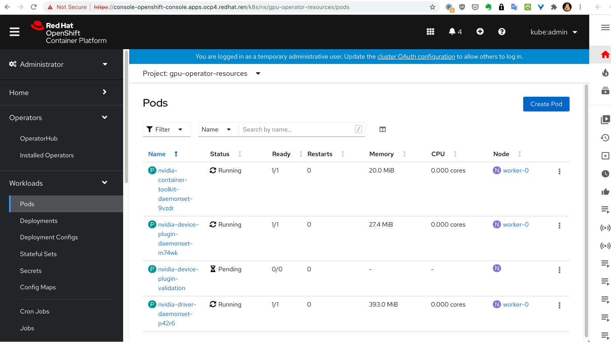

# openshift4 上 GPU/vGPU 共享

openshift/k8s集群上，运行了越来越多的AI/ML应用，这些应用大部分需要GPU的支持，但是英伟达/k8s官方的device-plug中，GPU的调度，是按照一块GPU为单元来进行调度的，这就在k8s调度层面，带来一个问题，即使GPU资源浪费的问题。

好在社区有很多类似的方案，比如[aliyun的方案](https://github.com/AliyunContainerService/gpushare-scheduler-extender)，就相对简单，当然功能也简单。本文就试图在openshift4上，运行aliyun的gpu共享方案。

由于aliyun等类似的方案，大多基于nvidia-docker，而openshift4使用了crio，所以里面有一点定制化的部分。

由于时间所限，本文只是完成了方案的大致成功运行，完美的运行，需要更多的定制化，这个就有待项目中继续完善吧。

注意
- 这是调度共享方案，不是共享隔离方案

todo
- 在真实的多GPU卡环境中验证。

视频讲解

[<kbd></kbd>]()

- [bilibili]()
- [xigua]()
- [youtube]()


## 部署运行 scheduler extender

aliyun类似的方案，都是扩展k8s scheduler的功能，来增强k8s已有的功能，在最新版本的openshift4中，已经可以通过配置，把这个scheduler扩展功能激活。

```bash
cd /data/install
cat << EOF > ./policy.cfg
    {
    "kind" : "Policy",
    "apiVersion" : "v1",
    "predicates" : [
            {"name" : "MaxGCEPDVolumeCount"},
            {"name" : "GeneralPredicates"},
            {"name" : "MaxAzureDiskVolumeCount"},
            {"name" : "MaxCSIVolumeCountPred"},
            {"name" : "CheckVolumeBinding"},
            {"name" : "MaxEBSVolumeCount"},
            {"name" : "MatchInterPodAffinity"},
            {"name" : "CheckNodeUnschedulable"},
            {"name" : "NoDiskConflict"},
            {"name" : "NoVolumeZoneConflict"},
            {"name" : "PodToleratesNodeTaints"}
            ],
    "priorities" : [
            {"name" : "LeastRequestedPriority", "weight" : 1},
            {"name" : "BalancedResourceAllocation", "weight" : 1},
            {"name" : "ServiceSpreadingPriority", "weight" : 1},
            {"name" : "NodePreferAvoidPodsPriority", "weight" : 1},
            {"name" : "NodeAffinityPriority", "weight" : 1},
            {"name" : "TaintTolerationPriority", "weight" : 1},
            {"name" : "ImageLocalityPriority", "weight" : 1},
            {"name" : "SelectorSpreadPriority", "weight" : 1},
            {"name" : "InterPodAffinityPriority", "weight" : 1},
            {"name" : "EqualPriority", "weight" : 1}
            ],
    "extenders": [
            {
              "urlPrefix": "http://127.0.0.1:32766/gpushare-scheduler",
              "filterVerb": "filter",
              "bindVerb":   "bind",
              "enableHttps": false,
              "nodeCacheCapable": true,
              "managedResources": [
                {
                  "name": "aliyun.com/gpu-mem",
                  "ignoredByScheduler": false
                }
              ],
              "ignorable": false
            }
          ]
    }
   
EOF
oc delete configmap -n openshift-config  scheduler-policy
oc create configmap -n openshift-config --from-file=policy.cfg scheduler-policy

oc patch Scheduler cluster --type='merge' -p '{"spec":{"policy":{"name":"scheduler-policy"}}}' --type=merge

```

然后我们就可以部署 scheduler extender 了

```bash
curl -O https://raw.githubusercontent.com/AliyunContainerService/gpushare-scheduler-extender/master/config/gpushare-schd-extender.yaml
# replace docker image
cd /data/install
sed -i 's/image:.*/image: quay.io\/wangzheng422\/qimgs:gpushare-scheduler-extender-2021-02-26-1339/' gpushare-schd-extender.yaml
oc delete -f gpushare-schd-extender.yaml
oc create -f gpushare-schd-extender.yaml

```

## operator hub 中添加 catalog source

我们定制了nvidia gpu-operator，所以我们要把我们新的operator加到operator hub中去。

```bash
#
cat << EOF > /data/ocp4/my-catalog.yaml
apiVersion: operators.coreos.com/v1alpha1
kind: CatalogSource
metadata:
  name: wzh-operator-catalog
  namespace: openshift-marketplace
spec:
  displayName: WZH Operator Catalog
  image: 'quay.io/wangzheng422/qimgs:registry-wzh-index.2021-02-28-1446'
  publisher: WZH
  sourceType: grpc
EOF
oc create -f  /data/ocp4/my-catalog.yaml

oc delete -f /data/ocp4/my-catalog.yaml

```
到此，我们就能在 operator hub 中，查找到2个gpu-operator了


## 安装 gpu-operator 并配置 ClusterPolicies

点击安装 nvidia & wzh 那个。

安装成功以后，创建 project gpu-operator-resources

然后在 project gpu-operator-resources 中，给gpu-operator创建一个ClusterPolicies 配置，使用以下模版创建

```yaml

apiVersion: nvidia.com/v1
kind: ClusterPolicy
metadata:
  name: gpu-cluster-policy
spec:
  dcgmExporter:
    nodeSelector: {}
    imagePullSecrets: []
    resources: {}
    affinity: {}
    podSecurityContext: {}
    repository: nvcr.io/nvidia/k8s
    securityContext: {}
    version: 'sha256:85016e39f73749ef9769a083ceb849cae80c31c5a7f22485b3ba4aa590ec7b88'
    image: dcgm-exporter
    tolerations: []
  devicePlugin:
    nodeSelector: {}
    imagePullSecrets: []
    resources: {}
    affinity: {}
    podSecurityContext: {}
    repository: quay.io/wangzheng422
    securityContext: {}
    version: gpu-aliyun-device-plugin-2021-02-24-1346
    image: qimgs
    tolerations: []
    args:
      - 'gpushare-device-plugin-v2'
      - '-logtostderr'
      - '--v=5'
    env:
      - name: NODE_NAME
        valueFrom:
          fieldRef:
            fieldPath: spec.nodeName
  driver:
    nodeSelector: {}
    imagePullSecrets: []
    resources: {}
    affinity: {}
    podSecurityContext: {}
    repository: nvcr.io/nvidia
    securityContext: {}
    repoConfig:
      configMapName: repo-config
      destinationDir: /etc/yum.repos.d
    version: 'sha256:324e9dc265dec320207206aa94226b0c8735fd93ce19b36a415478c95826d934'
    image: driver
    tolerations: []
  gfd:
    nodeSelector: {}
    imagePullSecrets: []
    resources: {}
    affinity: {}
    podSecurityContext: {}
    repository: nvcr.io/nvidia
    securityContext: {}
    version: 'sha256:8d068b7b2e3c0b00061bbff07f4207bd49be7d5bfbff51fdf247bc91e3f27a14'
    image: gpu-feature-discovery
    tolerations: []
    migStrategy: single
    sleepInterval: 60s
  operator:
    defaultRuntime: crio
    validator:
      image: cuda-sample
      imagePullSecrets: []
      repository: nvcr.io/nvidia/k8s
      version: 'sha256:2a30fe7e23067bc2c3f8f62a6867702a016af2b80b9f6ce861f3fea4dfd85bc2'
    deployGFD: true
  toolkit:
    nodeSelector: {}
    imagePullSecrets: []
    resources: {}
    affinity: {}
    podSecurityContext: {}
    repository: nvcr.io/nvidia/k8s
    securityContext: {}
    version: 'sha256:81295a9eca36cbe5d94b80732210b8dc7276c6ef08d5a60d12e50479b9e542cd'
    image: container-toolkit
    tolerations: []

```

至此，gpu-operator就安装完成了，我们可以看到，device-plugin的validate并没有运行，这是因为，我们定制了sheduler， nvidia.com/gpu 已经被 aliyun.com/gpu-mem 代替。 完美解决这个问题，就需要继续定制化了，但是系统已经能按照预期运行，我们就把定制化留到以后项目中去做好了。



## 测试以下

我们就来实际测试一下效果

```bash
cat << EOF > /data/ocp4/gpu.test.yaml
---
kind: Deployment
apiVersion: apps/v1
metadata:
  annotations:
  name: demo1
  labels:
    app: demo1
spec:
  replicas: 1
  selector:
    matchLabels:
      app: demo1
  template:
    metadata:
      labels:
        app: demo1
    spec:
      # nodeSelector:
      #   kubernetes.io/hostname: 'worker-0'
      restartPolicy: Always
      containers:
        - name: demo1
          image: "docker.io/wangzheng422/imgs:tensorrt-ljj-2021-01-21-1151"
          env:
            - name: NVIDIA_VISIBLE_DEVICES
              valueFrom:
                fieldRef:
                  fieldPath: metadata.annotations['ALIYUN_COM_GPU_MEM_IDX']
          resources:
            limits:
              # GiB
              aliyun.com/gpu-mem: 3

EOF
oc create -n demo -f /data/ocp4/gpu.test.yaml


```
进入测试容器，看环境变量，我们就能看到 NVIDIA_VISIBLE_DEVICES 被自动设置了


我们进入scheduler extender看看日志， 可以看到scheduler试图给pod添加annotation


我们再进入device-plugin看看日志，可以看到device-plugin在对比内存，挑选gpu设备。


