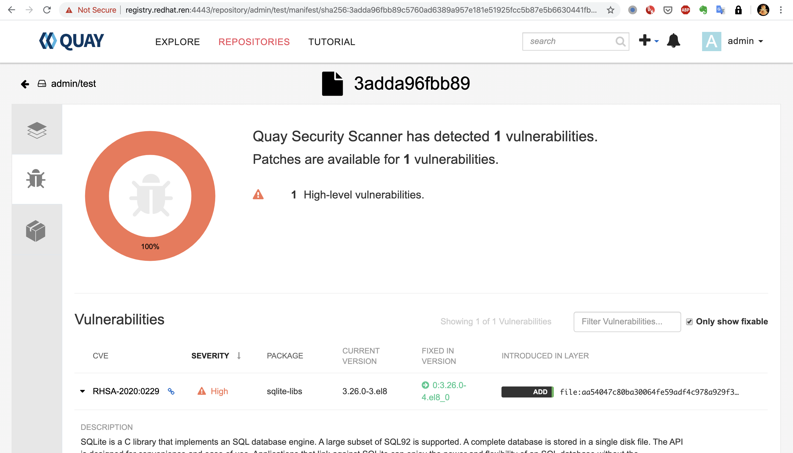
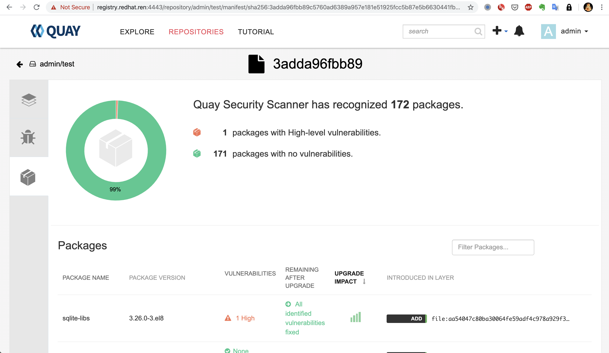

# Quay dev with clair deploy
本文描述，在 POC 场景下面，如何部署一个单机的quay，并且搭配一个单机版本的clair，演示安全扫描。

离线的数据，都在 docker.io/wangzheng422/quay-fs:3.2.0-init，文中有描述，如何提取数据和解压缩。

另外需要一些镜像，需要单独的打包。
```bash
yum install -y podman buildah skopeo
cat << EOF >>  /etc/hosts
45.63.58.108 registry.redhat.ren
EOF
# podman login -u="redhat+quay" ****************
firewall-cmd --permanent --zone=public --add-port=4443/tcp
firewall-cmd --reload

podman rm -fv $(podman ps -qa)
podman volume prune -f
podman pod rm -fa

podman pod create --name quay -p 4443:8443 

mkdir -p /data/

cd /data
rm -rf /data/quay
podman run -d --name quay-fs --entrypoint "tail" docker.io/wangzheng422/quay-fs:3.2.0-init -f /dev/null
podman cp quay-fs:/quay.tgz /data/
tar zxf quay.tgz
podman rm -fv quay-fs

export MYSQL_CONTAINER_NAME=quay-mysql
export MYSQL_DATABASE=enterpriseregistrydb
export MYSQL_PASSWORD=zvbk3fzp5f5m2a8j
export MYSQL_USER=quayuser
export MYSQL_ROOT_PASSWORD=q98u335musckfqxe

podman run \
    --detach \
    --restart=always \
    --env MYSQL_ROOT_PASSWORD=${MYSQL_ROOT_PASSWORD} \
    --env MYSQL_USER=${MYSQL_USER} \
    --env MYSQL_PASSWORD=${MYSQL_PASSWORD} \
    --env MYSQL_DATABASE=${MYSQL_DATABASE} \
    --name ${MYSQL_CONTAINER_NAME} \
    --privileged=true \
    --pod quay \
    -v /data/quay/lib/mysql:/var/lib/mysql/data:Z \
    registry.access.redhat.com/rhscl/mysql-57-rhel7

podman run -d --restart=always \
    --pod quay \
    --privileged=true \
    --name quay-redis \
    -v  /data/quay/lib/redis:/var/lib/redis/data:Z \
    registry.access.redhat.com/rhscl/redis-32-rhel7

sleep 10

podman run --restart=always \
    --sysctl net.core.somaxconn=4096 \
    --privileged=true \
    --name quay-master \
    --pod quay \
    --add-host mysql:127.0.0.1 \
    --add-host redis:127.0.0.1 \
    --add-host clair:127.0.0.1 \
    -v /data/quay/config:/conf/stack:Z \
    -v /data/quay/storage:/datastorage:Z \
    -d quay.io/redhat/quay:v3.2.0
# https://registry.redhat.ren:4443/
# quay admin:  admin   /   5a4ru36a8zfr1gp8

podman run --name clair-postgres --pod quay \
    -v /data/quay/lib/postgresql/data:/var/lib/postgresql/data \
    -d docker.io/library/postgres
sleep 10

podman run --restart=always -d \
    --name clair \
    -v /data/quay/clair-config:/clair/config \
    -v /data/quay/clair-config/ca.crt:/etc/pki/ca-trust/source/anchors/ca.crt  \
    --pod quay \
    --add-host clair:127.0.0.1 \
    quay.io/redhat/clair-jwt:v3.2.0

```
去quay上创建一个repository，然后push image试试
```bash
/bin/cp -f /data/quay/config/extra_ca_certs/redhat.ren.crt /etc/pki/ca-trust/source/anchors/
update-ca-trust extract

podman login -u admin -p 5a4ru36a8zfr1gp8 registry.redhat.ren:4443
podman pull docker.io/library/centos
podman tag docker.io/library/centos registry.redhat.ren:4443/admin/test:centos
podman push registry.redhat.ren:4443/admin/test:centos
```
可以看到，安全扫描已经生效。


